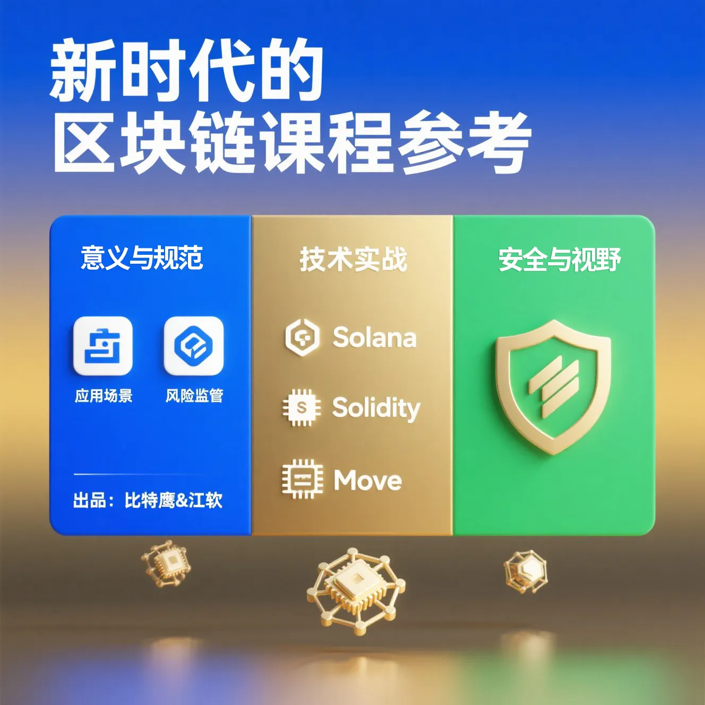

# 前言

比特鹰与江软达成深度合作后，

我们针对国内区块链教学材料和课程问题，进行了深入思考，发现了许多待解决的大问题，决定全力以赴，进行全面改良；

**现在，很多学生甚至工作了多年的从业者，常常感到迷茫：**

不知道为什么要学区块链；心里会有很多疑问，

「学了区块链，工作在哪找？真的能用吗？能应用到哪些地方？」

「到底是去搞技术、做交易，还是做投资？」

「国家是不支持虚拟货币的，区块链不就是虚拟货币吗，会不会有风险？」

现阶段大部分学校与培训班，还在沿用几年前的课程，概念上主要讲「以太坊基础交互」「比特币怎么挖矿」「去中心化是什么意思」，技术编程上主要讲「Solidity编程」；

这些知识固然重要，但放到今天已经太过基础，和现在的实际应用有很大脱节；

当前区块链的发展非常快，新概念与技术层出不穷：Rollup、账户抽象/链抽象、BRC-20、Perp DEX、算法稳定币、Pump.fun、Solana、Monad、Hyperliquid等；

所以，比特鹰想与江软一起深度合作，为大学生打造一套真正适合现在、面向未来的区块链新型教程，帮助大家跟上最新的区块链趋势，乘风破浪；

我们的课程是这样设计，包括这几个板块内容：

《我们为什么要学习区块链：应用场景与未来发展》

《区块链行业风险与监管：会不会犯法？》

《公链新王Solana极速开发：高性能DApp实战》

《Solidity开发高手课》

《未来新星Move：智能合约实战》

《掌握区块链安全》

《职业发展常用的工具与资讯平台》

**注意：**因区块链技术相关资源主要分布于海外网络环境，部分网站需通过虚拟专用网络（VPN）建立合规访问通道；