# Web3 运营学习手册

无论是 Web2 还是 Web3，营销始终是决定项目成败的关键一环。

尤其是在 Web3，每个岗位都该懂营销，

不管是写代码、做产品，还是发内容、建社区，最终都要传递给用户，影响项目成败。

但目前市面上几乎没有一门系统教你“Web3 营销怎么做”的课程。  
很多同学有心想学，但不知道从哪开始，也缺少实战路径。

因此，比特鹰团队联合多位 Web3 一线运营实战者，

从真实项目中提炼方法，为**江西软件职业技术大学·区块链学院**量身打造了这门课。

如果你是区块链学院的学生，未来想进入 Web3 行业，  
那么下面这些，**就是你必须掌握的核心本事****👇**

****

1、理解 Web3 运营的本质

2、学会讲叙事和造话题

3、内容创作与表达能力

4、社群搭建与运营能力

5、增长设计与用户激励机制

6、持续学习和思考能力

## 理解 Web3 运营的本质

首先我们要懂得 Web3 和 Web2 营销的根本区别

### 1. 在 Web2：用户是“消费者”

+ 看广告 → 下单 → 使用产品
+ 他们**只付钱**，很少参与产品本身的建设
+ 用户的价值，= 留存 + 转化 +付费能力

### 2. 在 Web3：用户是“参与者 + 贡献者 + 宣发者”

+ 可以参与产品共建（提建议、写内容、提PR）
+ 可以因参与而获得收益（空投、激励、治理权）
+ 他们**不仅是用户，也是流量源、建设者和代币持有者**

## 学会讲叙事和造话题

叙事就是方向， 方向对了，传播才有力

在 Web3，先让人记住你，才有可能让人参与你。

不管是一个刚起步的想法，还是已经上线的项目，

都必须找到一个足够吸引人、易于传播、有参与感的叙事，

这才是能让项目走得远、传得开的第一步。

### 1. 打造属于你的“Web3 第一”标签

什么是叙事中的“唯一性”？

它不是说你的项目“全宇宙独一份”，而是要占据用户心智的某一个“标签”。

#### 1.1. 浏览器插件钱包第一：Metamask

它不是最便宜、最好用的钱包，但它是第一个无需写代码、普通用户也能用的以太坊钱包，抢占了“链上入口”的用户认知。尽管竞争对手提供更低的交易费，等丝滑的功能，依然无法撼动 Metamask 作为首选加密钱包的地位。

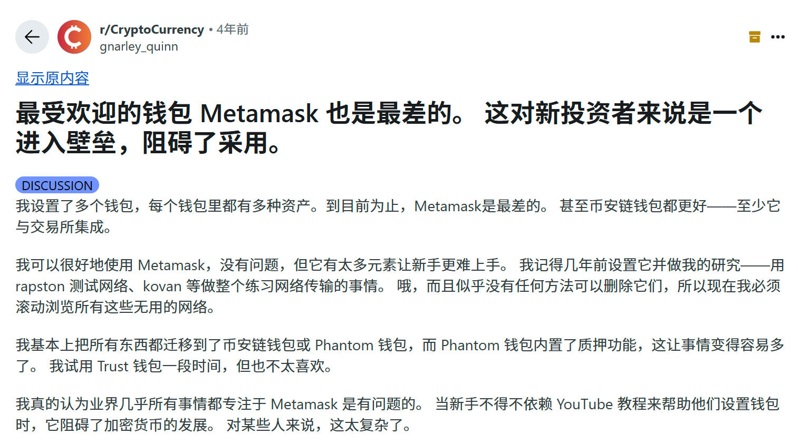

#### 1.2. 中国区手机钱包第一：imToken

imToken 上线于 2016 年，是不少中国用户接触的第一个手机区块链钱包。

虽然这些年产品更新不快，默认只支持 ETH、Bitcoin 和 Cosmos 三个网络，连 Swap 功能都没有，但它的用户量依然很大，官网数据显示，累计用户已超 2000 万。  

团队迭代能力很一般，甚至到今天，默认只有 ETH、Bitcoin、Cosmos 3个网络，甚至内嵌的 SWAP 都没有。笔者在私域社群里里经常看到有人问：“imToken 下载地址在哪？”

这说明，即使没强运营、没新功能，它依然是很多用户心里“最熟悉的钱包”。  

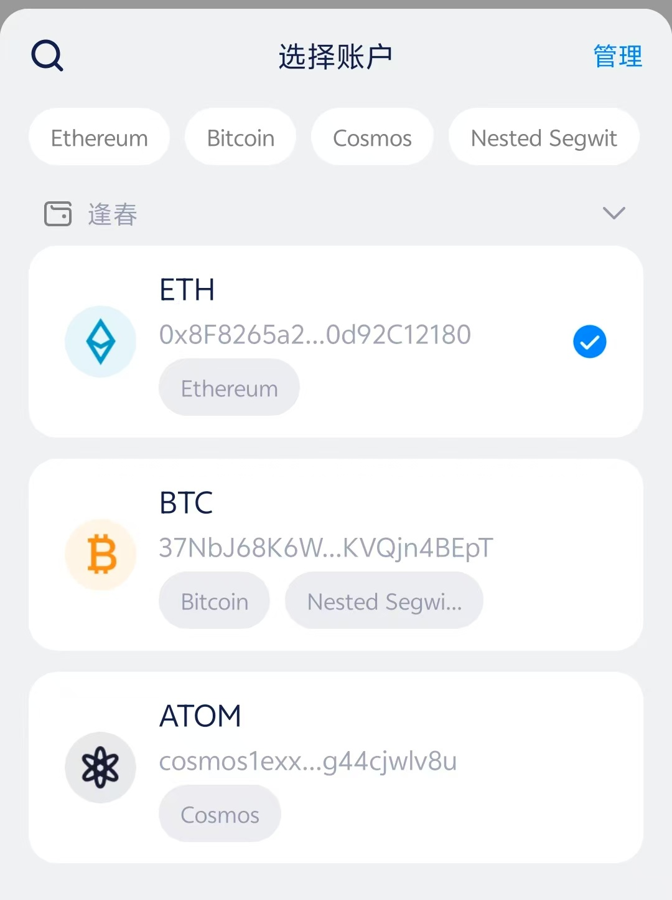

#### 1.3. 总结

**类似的故事还有很多，例如：**

+ Ordinals：第一个实现比特币链上铭文协议
+ Notcoin：第一个爆火的 Telegram 游戏 + 挖矿结合玩法
+ Uniswap：第一个使用 AMM 自动做市机制的去中心化交易所
+ ENS：第一个将以太坊地址映射为“.eth”人类可读域名的项目

无论是 Metamask 成为第一个普通用户能用的以太坊钱包，

还是 imToken 抢下“中文用户首选手机钱包”的心智，

它们胜出的关键，不是功能最强，而是：够早、够明确、让人记住。

**所以，做营销请记住：**

在 Web3 的传播逻辑中，“第一个”远比“最好”更重要。

运营要做的，不是讲一堆功能，而是提炼出产品最突出的、最创新的一点，并把它包装成一个‘唯一性’故事传播出去。

无论是机制创新、场景切入，还是目标人群不同，**你都必须找到一个角度，让项目看上去像是“第一个这么做的”。**

如果你找不出“第一个”，那问题可能不在运营，而在产品本身。没有独特卖点，运营就是在“卖一个平庸的功能集”。

### 2. 另辟蹊径，也能做“第一”

大家会发现，目前大多数热门赛道早已被先行者占据。

这也是你必须跳出红海、创造差异化叙事的理由。

与其在主战场卷死，不如另辟蹊径，重新定义一个“小赛道”，抢占一个“另类的第一”。

#### 2.1. 案例解析：Uniswap V2 带来的机会

Uniswap V2 采用 MIT 开源协议，任何人都可以复制、修改并商用。

于是，一批项目抓住了这个机会，虽然没能成为以太坊上的第一个 SWAP，却在别的链上拿下了“第一个”。

+ QuickSwap 成为 Polygon 的第一 SWAP
+ PancakeSwap 成为 BNB Chain 的第一 SWAP
+ Trader Joe 成为 Avalanche 的第一 SWAP

这些项目通过 Fork + 本地化适配，分别成为各自链上的龙头。

尤其是 PancakeSwap，如今单日手续费达 931 万美元，月收入高达 1.89 亿美元，甚至一度超过了 Uniswap 的链上收入。

试想一下，

如果 PancakeSwap 当年也部署在 ETH，即使功能更强、激励更猛，也很难撼动 Uniswap 的地位。

正是“换一条链，做另一个第一”，让它完成了弯道超车。

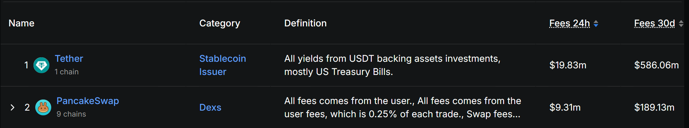

#### 2.2. 案例解析：Pump.fun 带来的机会

Pump.fun 是近两年 Web3 最大的吸金黑马。

截至 2025 年 6 月 12 日，营收已突破 7.5 亿美金，日交易热度长期霸榜 Solana。

它的本质创新很简单：

+ 降低 meme 币发行门槛
+ 无需代码、3 秒发币、极致轻体验

随后专注于 BNBChain 的 BinaryX 团队就嗅到了商机

他们几乎原样复刻了 Pump.fun 的核心玩法，推出了 BNBChain 的 meme 发币平台，Four.meme。

虽然玩法几乎没有改动，但因抢占了 BNB 生态的空白市场，Four.meme 依然迅速起势。

截至 2025 年 6 月 12 日，平台营收已接近 1134 万美元。

虽然远不及 Pump.fun 的体量（7.5 亿美元），但对于处在下滑边缘的 BNX 项目来说，这无疑是一次“逆风翻盘”

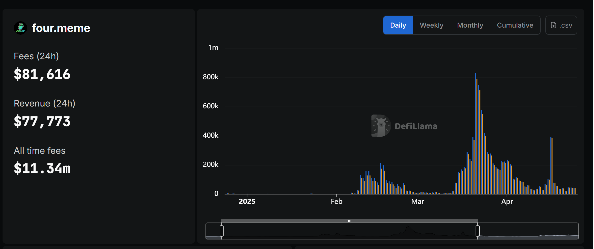

#### 2.3. 案例解析：StepN

2021 年，区块链游戏迎来大爆发，

以 Axie Infinity 为代表的链游赛道出现了井喷式增长，资本和用户蜂拥而至。

就在这个火热时期，有个项目走出了一条完全不同的路——StepN。

它清楚自己无法在传统链游领域挑战 Axie 的地位，于是果断另辟蹊径，提出了一个全新的概念：运动赚钱

通过将“跑步”与链上资产绑定，StepN 成功开辟出一个全新的利基市场，

不仅避开了传统链游的正面竞争，还迅速成为“运动赚钱”赛道的代名词和龙头。

#### 2.4. 总结

就算你做不出全网最牛的创新，

只要你能找到一个别人还没做的地方去复制爆款，照样能打出成绩。

换条链，换个角度，或者换个用户群，

你就能把一个“别人的成功”，变成“你的第一个”。

别死磕正面刚，把老想法搬到新地方，

也能赢得漂亮。

### 3. 让项目出圈的关键：造话题和讲故事

#### 3.1. SLERF：灾难变营销，Web3 最大乌龙

2024 年 3 月 19 日，Memecoin SLERF 项目在 Solana 上预售，募集超过 5 万枚 SOL。

原计划是给预售用户发放 $SLERF 代币，但没想到，项目方 @Slerfsol 一条推文引爆全网

他“手一抖”，误操作销毁了 LP 和空投预留的全部代币，甚至连铸币权限也一并撤销。

整个社区顿时炸锅，他自己也在 X 上开启 Space 当场“哭了出来”，瞬间成为币圈名场面。

但最戏剧性的还在后面。这场彻底失控的事故，反而成了最强营销事件.

事件发酵不到 30 分钟，全网传播，SLERF 直接爆红，市值破亿，最高一度冲上 7 亿美金，登顶当时 meme 榜首，堪称一夜封神。

尽管现在热度已过，但 SLERF 用“事故 × 情绪 × 全网参与”证明了：

只要话题够疯，连灾难也能变成资产。

#### 3.2. XEN：刷屏全网的免费挖矿实验

2024 年 9 月，一款突然爆火的区块链项目 XEN，刷屏了整个 Web3 圈子。

这个项目制造的话题度极强，让它迅速成为社群热议焦点：

+ 创始人背景离奇：自称是 Google 第 21 号员工，Jack Levin
+ 免费挖矿机制：不卖币、不预售，只要付 gas，就能免费铸造 XEN
+ 链上燃烧级别事件：短时间内导致 ETH 网络严重拥堵，gas 飙升，一度占据以太坊 24 小时内 47% 的 gas 销毁量

这样的设定，让 XEN 在没有空投、没有资本背书的前提下，仅凭话题性就席卷 Web3 社群，

迅速引发链上“免费挖矿”风潮，成功打响品牌，完成一次极具话题驱动力的冷启动营销。

#### 3.3. LOVE：一笔 0 ETH 转账引爆 12 万地址的链上情绪

2024 年 5 月 30 日，加密 KOL @M4573RCH 发起了一场实验，推出了 Meme 代币 $LOVE。

没有预售、没有公售，只需向指定地址发送 0 ETH，即可参与空投。

就是这样一个极简的操作，迅速引爆了社群。

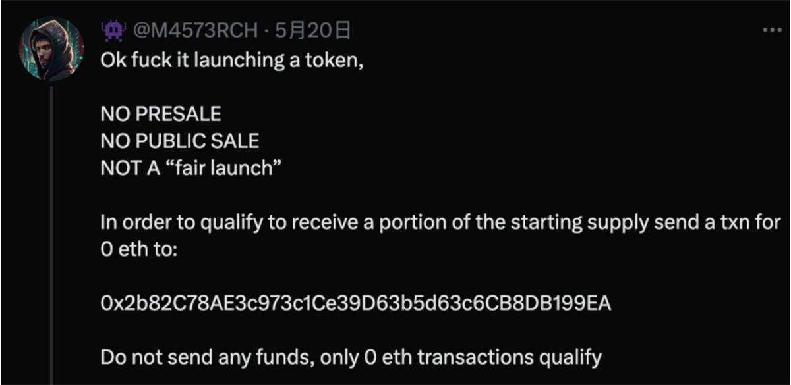

让我们把视角转向 LOVE 的市场传播表现：

+ 官方 X 账号在 5 月 27 日注册，仅用 4 天就吸引了超 18,000 名关注者
+ 上线当天，$LOVE 的 ETH 销毁量一度超过 Uniswap，成为以太坊全网销毁量第一名
+ 根据链上数据，空投期间共有 126,896 个地址符合领取条件

在 Web3，传播从来不靠精美PPT或复杂技术，

而是靠：“一个人人都能讲的故事 + 一个人人都能参与的动作 + 一种情绪共振的氛围”。

想做爆款，不如先问自己一句：

这个项目的故事，你讲得出口吗？别人愿意讲下去吗？

## 学会内容创作能力

### 1.  为什么每个人都应该学内容表达？

持续输出好的内容，其实就是在不断地和别人建立信任。

不管你是做产品的、写代码的，还是运营社群的，如果别人从来没听说过你，也不知道你在干什么，那他们就不会信任你，更不会主动了解你的项目。

而你做内容，就是在告诉别人你是谁、你在干嘛、你靠不靠谱。

内容包括很多形式：一篇项目介绍、一次更新日志、一条教程、一个宣传图，甚至一条推文、一个帖子，都是内容。  

这些东西不断地出现，别人就慢慢对你有印象、觉得你稳定、你认真、你靠谱。  
互联网让传播变得很快也很便宜。尤其是在 Web3 这个行业，很多项目都是从 X、TG、Discord 这些地方火起来的，背后靠的就是内容。只要你有价值、表达清楚、节奏对，就能快速被关注。

**Web3 的传播方式和传统公司不一样，不是广告打出来的，是社区讨论出来的，是社群自发传播的**。信息是从下面往上走的。只要你做出一点好的内容，就能被放大、被传播。

  
**圈子不大，一旦有东西出圈，效果非常快。**

所以内容不是运营一个人的事，所有人都要有意识地表达自己在做什么，输出对别人有帮助的信息。久而久之，大家就会信任你，愿意支持你。

这就是内容创作的底层逻辑：**让别人知道你、记住你、相信你。**

### 2. 什么样的内容最受欢迎

#### 2.1. 为用户创造价值的内容

这是 Web3 用户最直接感知到价值的一类内容。

它的最大特点是：马上能动手或者学习，马上有结果。

比如：

+ 最新的链上空投教学（如 Binance Alpha、Monad 等热门交互机会）
+ 手把手教你挖掘低市值、有潜力的 Meme 币
+ 推荐一个年化收益超高的稳定币质押平台
+ 从 0 到 1 教你如何运营一个 Web3 项目
+ 专为小白设计的入门教程，帮你快速看懂链、钱包、DEX、NFT 等核心概念

这类内容的核心，就是“能落地、能赚钱、能看懂”。

谁讲得清楚、谁给的机会真实，谁就能吸引用户关注、信任和长期追随。

#### 2.2. 时效性强的内容

这类内容的核心就是一个字，快。

全世界的人都爱吃瓜，尤其是突发新闻和圈内大事。

当马斯克开喷特朗普、爆出爱泼斯坦名单；

当特朗普说“洛杉矶被外国敌人入侵”；

第一时间谁发了、谁说得有趣，谁就赢得了注意力。

在 Web3 也一样，时效性内容永远是流量密码：

+ 某项目突然上线、宣布合作、冲上交易所或开放空投
+ 某项目被黑了，全网炸锅
+ 某个大 KOL、VC、巨鲸地址突然操作
+ 链上数据异常，比如 gas 飙升、成交量暴涨
+ 某个 meme 或 narrative 突然爆火（比如“政治币”“AI Agent”）
+ 各种“你还来得及参与”的机会提醒

谁能**第一个发现 + 说清楚 + 引导参与**，谁就能拿到更多流量。  
这不仅能带动点赞、转发、评论，还能帮你树立圈内“消息源”的形象。  
要记住：**热点永远不等人，出手就得快、狠、准。**

****

#### 2.3. 有趣/吃瓜类的内容

在信息爆炸的 Web3 世界，有趣就是竞争力。

再专业的内容，如果让人打哈欠，就没人愿意看。

而真正有趣的内容，能让人笑出来、惊一下、共鸣到，然后自然转发。

什么内容容易让人觉得有趣？下面给一些案例：

+ 价值 109 美金的的排插骗局

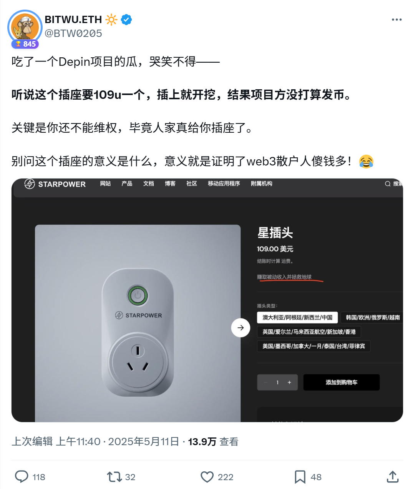

+ 近期一段“疑似 Binance 联合创始人何一早期参加《非诚勿扰》”的视频，在圈内刷了屏。  
虽然视频内容、配文几乎一模一样，但不同博主分别发出来，依然都获得了不错的流量。
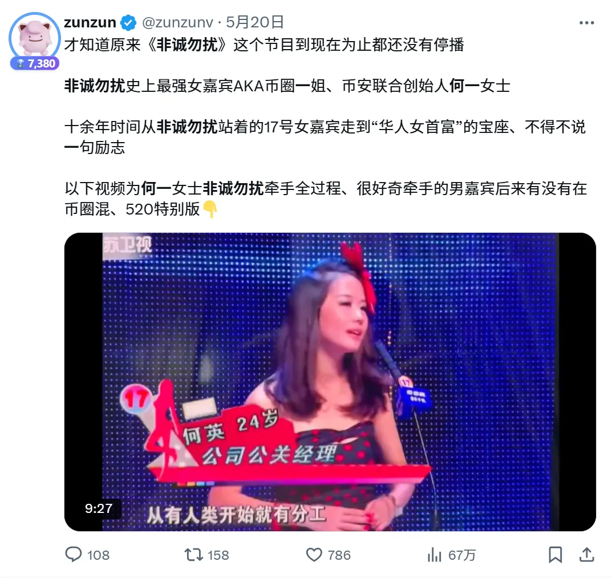

#### 2.4. 持续性/系列内容

这类内容就像品牌的“定期广播”，不是靠一两次爆发，而是靠持续不断地输出，逐步在用户心中建立稳定的认知。

适合做成系列内容，每周、每月定期更新，让用户形成“记忆锚点”，只要想到某个领域，就会想到你。

以下是一些经典案例： 

+ [Layergg](https://x.com/layerggofficial)：长期坚持整理 Web3 每日、每月大事件，如今已经成为不少人月初、年初必看的信息来源。内容本身不复杂，但他靠着持续更新、格式清晰、节奏稳定，把账号做成了 Web3 信息导航入口，也让用户形成了“遇事看 Layergg”的习惯。

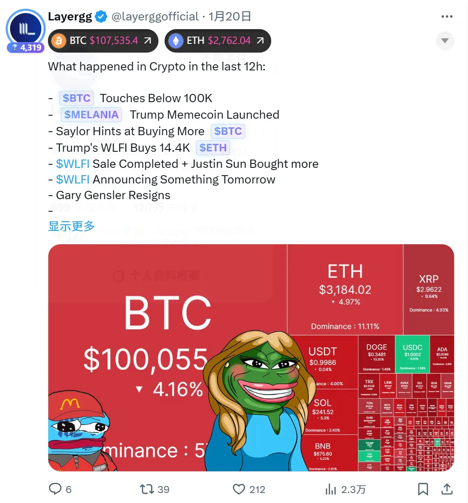

+ [Ai 姨](https://x.com/ai_9684xtpa)，一直专注在 Web3 链上数据这个垂直领域，几年如一日地输出内容，目前已经成为该领域的头部  
24年 Ai 姨的广告摊位费是 300 美金，25 年的费用已经涨至 2000 美金

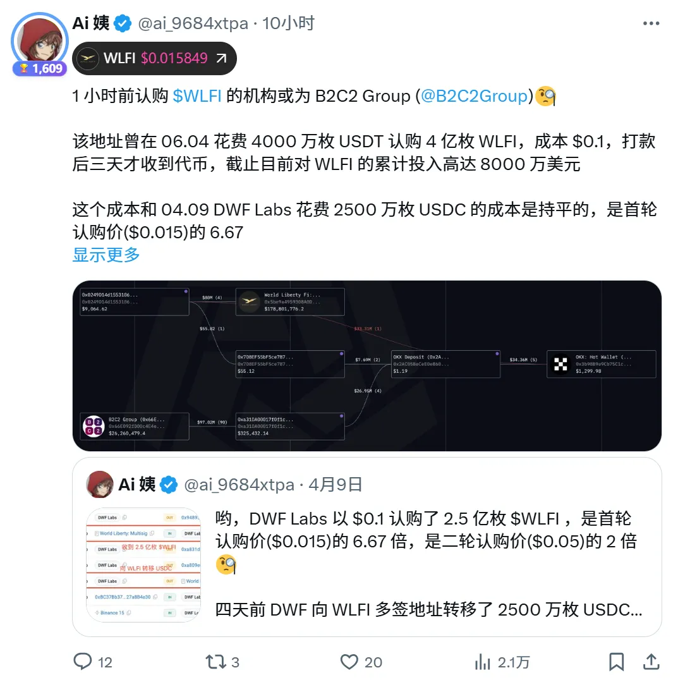

+ 杀破狼：坚持输出高质量图表，不需要任何 Web3 基础，只需要整理数据并整合，办公室文员都能做。  
但他坚持做了找个系列，靠稳定输出和持续积累，如今也成为 Web3 领域的头部 KOL。

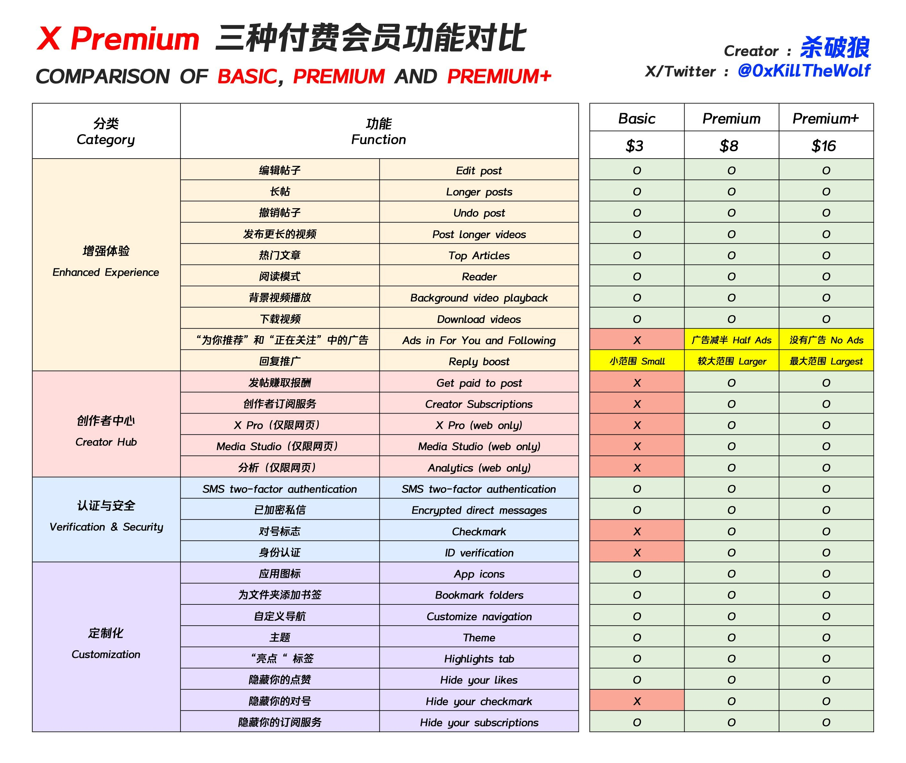

### 3. 怎么写好一份内容

#### 3.1. 确定营销的唯一目的

写内容之前，先想清楚两件事：

👉 你希望读完后，读者做什么？

是关注你、点赞转发，还是点链接参与项目？

👉 你是写给谁看的？

是刚进圈的 Web3 小白，还是天天盯链上数据的老玩家？

想清楚之后，就要围绕这两点点，精准出击

内容创作别贪心，别一次塞太多任务给用户

一边想让人关注，一边又让人注册，还想转发抽奖，用户只会觉得累，直接划走。

一个内容，只聚焦一件事，才能让人真的行动。

#### 3.2. 90% 的时间用来思考标题

80% 的人只看标题，根本不会点开内容。你内容写得再好，没人看就是白搭。

所以标题必须狠！要做到一眼吸住 + 正中需求 + 引爆情绪。

很多同学有个误区：以为标题一定要和内容完全对应。其实不是。标题的首要任务是让人点进来，而不是准确概括内容。

别太纠结“准确”或“文采”，真正有效的标题，是够狠、够夸张、像广告一样抓人。稍微偏离主题没关系，只要能让人忍不住点开，就已经赢了一半。打开率才是王道。

下面给大家看一些案例

❌「何一早期参加非诚勿扰片段曝光」

✅「疑似曝光何一的早期恋爱史，全网疯传」

第一个标题标题信息太完整，用户看完就知道是“非诚勿扰 + 何一”，没有点击欲望。

第二个标题 保留悬念：“疑似”“恋爱史”“疯传”都在制造钩子，引发用户好奇：是她本人吗？真的谈过恋爱？到底传了啥？  

不要把“答案”直接写在标题里。好标题永远让人产生**“我想点进去看看”**的冲动，而不是“看完标题就知道了”。  

❌「TP钱包被盗案背后的真相：币圈安全启示录」

✅「又暴雷了！TP 钱包被盗！2亿资金被盗，涉及所有 Web3 用户！」

第一个标题太正经、太“概括型”了，像论文标题，没情绪、没钩子、没急迫感。

用户会觉得：“哦，是安全类科普，不急着看”

第二个标题通过“又暴雷了”：制造恐慌感 + 连续性，“2亿资金被盗”：强调损失规模，放大冲击力，“涉及所有 Web3 用户”：强相关性+制造“你可能也有危险”的代入感。

不要讲“真相”，要制造“危机”，标题里要有情绪、具体的数字、代入感

总之，在 Web3 内容营销中，标题比内容更重要。

哪怕你写得再专业、逻辑再清晰，如果没人点开，一切都是“写了个寂寞”。

想写出点击率高的标题，请牢记：

1、别讲事实，讲情绪： 

情绪 > 信息，恐慌、羡慕、愤怒、贪婪都能驱动点击。  

2、 别太准，得夸张：

稍微“离谱”一点的标题，才能抓住眼球，标题不是总结内容，而是引人点开。

3、 别全说完，要留钩子：

把故事讲一半，让读者脑子里冒出一句话：“我想知道后面发生了什么”。

4、 别装文艺，像广告一样狠：

用最直白、刺激、情绪拉满的词，比如「暴雷」「爆了」「疯传」「全网都在看」等。

**怎么学习写标题？**

****

最简单有效的办法就是：**学会“借鉴”！**

直接去看那些写得好的，爆款不断的账号，他们已经帮你踩过坑，总结出了最优解。

以下是推荐学习渠道：

**公众号推荐**

+ 【刘润】：商业逻辑、职场案例，标题写得极其抓人
+ 【金错刀】：典型的爆款风格，善于用冲突、情绪和数字打动人

  
 **头条 / 小红书 / B站  **

+ 打开首页，看爆文标题是怎么写的，尤其注意高播放高收藏的视频标题
+ 模仿他们的结构、用词、情绪词，逐句练习

** 建立个人标题库  **

+ 每天手动收集 5 个让你忍不住点开的标题
+ 标注它用了什么公式（数字？反转？冲突？钩子？）
+ 久而久之，你会“下意识”写出好标题

 记住：别把写标题当成写作文，它更像是在写广告文案！  

#### 3.3. 尽可能说大白话

内容一定要“讲大白话”，能用一句话说清楚的，就别写成一段。  

复杂的术语和行业黑话，除非特别必要，尽量翻译成普通人能懂的说法。  

你不是来炫技的，是来让人看懂、愿意看、看完能转发的。

Web3 的信息很多，刷 X，看公众号都是碎片化时间，比如地铁、公交、上厕所、等电梯……都是快速一划，缺乏足够的耐心。

#### 3.4. 形成自传播

在 Web3 里形成「自传播」，不是锦上添花，而是 生死攸关。

Web3 初创团队不像 Web2 有广告预算，获客靠啥？

靠用户自来、用户帮你带用户，一传十，十传百。

这就是自传播的本质。

Web3 的热度窗口很短，一个热点最多红 3 天，

你不能等用户慢慢发现你，必须靠用户主动发、转、晒，才能抢在黄金窗口爆起来。

那么如何让用户自传播呢，下面梳理了几个技巧

##### 3.4.1. 给用户“身份感”

Web3 里有很多种创造这些感受的方式，有的是技术手段、有的靠差异化运营。

把用户变成产品的一部分，例如加上「OG」「创世成员」等标签

给上一定的代币激励或者未来承诺

##### 3.4.2. 给一定的激励

 没人会白帮你转，得让他有动力：  

+ 有奖励（产品VIP、空投资格、NFT白名单）  
+ 有门槛（转发才能进社群）

##### 3.4.3. 简单易传播

最被转发的不是长文章，而是**一张图 + 一句话**

信息密度高、视觉冲击强，特别适合 Web3 用户的碎片化阅读

加个标题党级文案，就是天然的种子传播单元

##### 3.4.4. 追热点

有突发新闻（黑客、政策、暴雷、上线、KOL 吃瓜），第一时间输出观点 + 配图，天然自带流量

反应速度决定你能不能卡在第一波传播周期内，如果有现成模板或素材库，更容易秒出图、卷速度

[金十数据](https://weibo.com/igoldman?is_all=1)在这方面很值得学习和参考

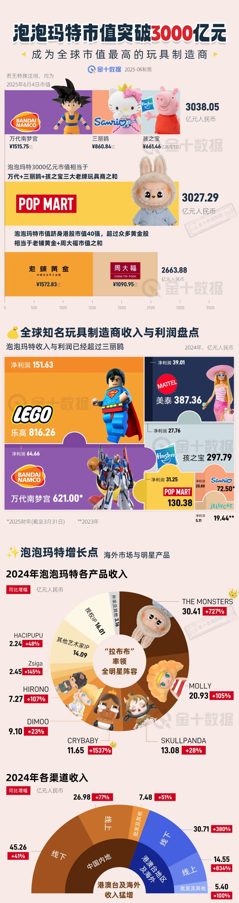

### 4. 内容营销的渠道/工具选择

#### 4.1. 核心内容发布渠道

以下是常见的内容发布平台，适合输出深度观点、建立品牌影响力：

| **渠道** | **类别** | **适合内容** |
| --- | --- | --- |
| [X](https://x.com/)（推特）、[farcaster](https://farcaster.xyz/)、小红书 | 公域流量拓展 | 项目动态、公告、热点段子、互动海报 |
| Telegram、Discord | 私域流量留存 | 实时公告、项目更新、用户互动、任务引导 |
| Mirror、Medium、微信公众号 | 公域流量拓展 | 深度文章、教程分析、项目科普 |
| YouTube / Bilibili | 公域流量拓展 | 视频讲解、AMA直播、纪录片、项目故事 |

#### 4.2. 常用到的工具

| **工具** | **用途** |
| --- | --- |
| [Canva](https://www.canva.cn/) | 设计传播视觉图、海报、推文配图 |
| [ChatGPT](https://chatgpt.com/)、[ideogram](https://ideogram.ai/) | AI 生图 |
| [ChatGPT](https://chatgpt.com/) | AI 润色文案、文章 |
| [谷歌表单](https://docs.google.com/forms/u/0/create?hl=zh-cn) | 收集用户反馈、问卷、参与信息 |
| [artstation](https://www.artstation.com/)、[pixabay](https://pixabay.com/zh/)、[pinterest](pinterest)、 | 图片搜索 |
| [zuomeme](https://www.zuomeme.com/) | Meme 图制作 |

#### 4.3. 单独讲一下 X

X（Twitte）是 Web3 领域最高效的社交媒体平台之一。是运营人员需要熟练掌握的一个平台
创始人/团队成员可以通过传递产品理念、团队的态度与专业性、以及未来的规划。
以下分享一下关于 X 的技巧

#### 4.4. 新 X 应该注意的事项

因为考虑到现在注册 X 不方便，大部分用户都是从第三方平台购买 X，

此外还要注意不要频繁的切换 IP，注册前三天不要发文，等缓个几天，按照以下流程执行：

1、修改邮箱

2、确定并修改推特资料( 名字、头像、简介、横幅  )

3、添加或修改 2fa 验证  

4、修改密码

5、开通蓝V

#### 4.5. 标签的重要性

加上合适的标签，推文才能进入对应的话题页面，有机会被更多非粉丝用户看到。

尤其是像 $BTC、#Airdrop 这种热门标签，自带巨大流量池，能帮你轻松获取圈外曝光。

但要注意，标签必须贴合内容主题，不要乱打热门、也不要一次打太多（不超过 4 个）。

标签太杂、或和内容无关，反而会被算法判定为低质量内容，影响推送权重。

**标签 $：**

这是 Web3 圈的默认格式，很多用户会直接搜索 $TOKEN 名来看项目动态或讨论。

例如：$BTC（而不是 BTC）$ETH

**标签 #**  
常见话题标签，除去 Token 都可以用，例如：#Airdrop #Biance

## 社群搭建与运营能力

### 1. 如何做好一个 Web3 社群

#### 1.1. 社群引导的第一要务：让新人“秒懂你是谁、在做什么、什么不能做”

新人加入社群时，最重要的一步就是**快速建立认知**。

他们不应该靠猜，而是通过清晰的「置顶帖」和频道命名以及介绍，几秒内搞懂三个核心信息：

1. 你们是谁
2. 在做什么
3. 为什么值得关注

**固定展示以下关键链接**：

+ 官网链接
+ 社交媒体链接
+ 白皮书
+ 简洁的介绍性图文 / 视频
+ 加入任务、参与活动的入口

 这些可以通过机器人设置自动欢迎和推送，也可以整理为【新手导航帖】或【入门指南频道】。 

但最关键的是：

**社群管理者、项目方、核心用户要有统一共识，反复强化“我们是谁、为什么存在”的叙事。**

光靠 bot 不够，人带人的氛围感，才是 Web3 社群真正能留人的秘密。

社区一旦认可某一种文化就很难改变，因此必须从一开始就为可接受的行为设定明确的界限。

明确哪些行为可能会导致禁言，并快速一致地处理违规行为。

#### 1.2. 制定奖励机制：用好激励手段提升活跃度

激励机制不是发糖果，而是建立价值共识的一种方式。

让成员知道：他们的每一次发言、创作、反馈，都是项目成功的一部分，并且值得被看见、被奖励。

以下是一些比较社区奖励机制：

##### 1.2.1. 身份激励

通过日常聊天活跃度、活动参与频率，发放不同等级的身份徽章、标签或称号，强化归属感与荣誉感。  
如“核心成员”“超级贡献者”“早期见证人”等。

##### 1.2.2. 任务激励

设置可执行的任务目标，如邀请好友、撰写内容、参与测试，完成即有奖励（积分/NFT/白名单等），既能调动积极性，也能扩散影响力。

##### 1.2.3. 排行榜激励

建立公开可视的活跃度排行榜，让竞争带来动力。例如每周前十名获得特殊奖励，形成正循环。

##### 1.2.4. 创作激励

鼓励用户产出图文/视频内容，通过点赞数、阅读量等指标发放激励，既促进内容传播，又增强社区话语权。

#### 1.3. 打造“社区拥护者的武器库”，让传播更顺手

想让社区成员自发传播项目，不能只靠一句“兄弟帮忙转发”，必须给他们一套顺手、好用、风格统一的传播工具。这就是我们常说的“社区传播武器库”。

一个好的武器库应该具备两个特点：

+ **丰富**：什么形式的内容都有，图文、视频、短语录、表情包等，方便不同人群快速使用。
+ **匹配**：风格调性要与项目形象一致，比如 meme 项目就不能做得太正经，技术项目就要尽量专业可信。

+ **Meme 表情包**：最好围绕项目 IP 或近期热点场景来制作，幽默、有梗、易于二次传播。
+ **活动海报模板**：例如邀请制活动、Space 预告、任务打卡等，可以做成系列风格，便于统一视觉、批量生产。
+ **内容类资产**：定期发布的深度内容，如创始人观点、行业洞察、AMA 精华、有奖征文等，提升项目权威性与可讨论性。
+ **阶段进展通报**：项目每达成一个关键进展，如数据增长、合作上线、版本更新，都制作成告示型图文，便于快速转发。
+ **结合项目特色的小内容**：
+ GameFi：短视频试玩片段、用户游戏记录图
+ 教育类：学习任务证书生成图
+ 技术类：每日一个技术知识点图解

### 2. 选对工具平台：不同平台适配不同策略

#### 2.1. Telegram

适合全球用户，门槛低、上手快，是 Web3 最主流的社群平台之一。适合用来承接空投用户、跑任务用户、早期社区建设。配合机器人可以自动化管理群规、任务、奖励等。

Telegram 必须掌握以下机器人 BOT 的使用技巧 

##### 2.1.1. [ROSE](@MissRose_bot)

全能机器人

支持进群欢迎、防广告、设定违禁词、关键词回复

[网页版本学习教程](https://www.tjsky.net/tutorial/594)、[视频教程](https://www.youtube.com/watch?v=IjPn-aNsNC0)

##### 2.1.2. [Safeguard](https://t.me/safeguard)

电报社群门户，安全验证机器人

##### 2.1.3. [Raidar](https://t.me/raidar)

电报社区冲推机器人，支持社区成员绑定自己的 X，管理员可发布突袭任务（给指定推文转发+点赞），全程在电报完成

#### 2.2. Discord

适合构建结构更复杂的社区（如 NFT、GameFi、DAO）。功能强大，适合多人协作、设立多个频道、分层权限管理。缺点是学习成本高、中文用户适应度不如 TG。

Discord 的机器人系统比 TG 更强大，可以参考以下教程学习：

[工具帖 | 5个Web3社区必备的Discord机器人](https://www.panewslab.com/zh/articles/iqxwj1v0)

[Discord Bot 教程系列](https://www.youtube.com/watch?v=5G4Q_GLKAn0&list=PL6nG8Y7KQjA-COaThDSds2r6ncgXo-Zn7)

#### 2.3. 微信群

适合维护小而紧密的用户圈层，适合做私域运营、种子用户维护、KOL关系维护。不适合大规模冷启动。

微信群无法配置 BOT，非常容易被风控，这点要特别注意。

例如 Web3 加密货币等关键词最好不要出现，若你的用户大部分来着国内，必须使用微信运营

建议用一个微信号把所有用户加一遍，然后该微信号不发任何关于 Web3 的内容，也不能做社群的群主，只做拉人和留存的角色。这样就算群被封了也不用担心用户流失。

#### 2.4. 推特社群

 X（推特）是 Web3 项目最重要的内容分发和舆论发酵平台。适合输出观点、抢占 narrative、发布空投、做话题传播。推特社群可做长期运营补充，但用户粘性不如 Telegram 和 Discord。

## 增长设计与用户激励机制

在 Web3 运营中，增长的关键不是“花钱投广告”，而是用有限的资源，制定好一套有吸引力的“游戏规则”。让用户不仅是参与者，更成为你的推广者和共建者，一起把项目推向更大的人群。

本章节将教大家怎么通过设计“任务 + 奖励机制”来吸引用户、留住用户、激活用户，从而让一个 Web3 项目从 0 到 1 实现增长。

下面，我们将拆解一些实战中常用的增长策略和激励技巧。

### 1. 空投激励：撬动早期用户注意力和参与感

空投是 Web3 项目最常见的冷启动方式之一。

尤其是产品上线前，是最好铺开营销的一条路。

#### 1.1 交互空投

交互空投是指项目方根据用户在早期阶段的链上行为（如转账、交易、桥接、质押、治理投票等），来判断用户的活跃程度，并据此分发 Token 奖励。    

适用项目

+ **大型基础设施类项目**：如公链、L2、跨链桥、去中心化协议等
+ **冷启动或测试阶段**：鼓励用户实际使用产品，为主网正式上线积累用户与数据

代表案例  

+ **Optimism（OP）**：根据用户在 L2 网络上的交互记录进行多轮空投，覆盖早期桥接、治理参与者等
+ **Arbitrum（ARB）**：对早期交互地址进行多维度打分（交易次数、周期、合约数量等）决定空投数量
+ **Starknet、zkSync 等 ZK 项目**：皆预期采用交互+行为评估来决定最终空投资格

设计维度

+ 交易次数（活跃度）
+ 活跃周期（非一次性交互）
+ 合约交互多样性（用过哪些协议）
+ 转账、交易金额（资金量）
+ 是否为真实用户（非批量机器人钱包）
+ 是否早期参与（时间窗口）

激励效果  

+ **对项目方**：精准筛选“真实用户”并形成产品早期数据积累
+ **对用户**：高价值回报，鼓励持续参与和链上行为
+ **对市场**：建立话题性，吸引用户主动使用其他新链、测试网

注意事项 

+ 容易被“羊毛党”批量注册和刷行为，因此大项目常配合反 Sybil 策略（如跨合约验证、持仓分布、Gitcoin Passport 等）  
+ 用户一般只对高融资，强背景的项目有交互的兴趣，不适合于新项目

#### 1.2. 吸血鬼空投

吸血鬼空投是一种直接“针对竞品用户”的空投策略：  
项目方通过识别其他协议的用户地址，并向其空投代币，**诱导其迁移到本项目**，达到“吸走对手用户”的目的。  

目标目的

+ 快速获取真实、活跃的行业用户
+ 打击/对标竞品，制造话题与流量
+ 构建社区初始种子用户池（精准且具参与习惯）

 典型案例  

+ **SushiSwap vs Uniswap**：  
Sushi 将 $SUSHI 空投给在 Uniswap 上提供 LP 的用户，成功吸引大量资金迁移
+ **1inch、dYdX、LooksRare、Blur**：  
均通过吸血鬼空投对 Uniswap、OpenSea、GMX 等头部协议用户进行定点攻击
+ **Blur 空投给 OpenSea 高交易用户**：  
实现了用户迁移 + NFT 市场格局重构

操作方式

+ 链上分析竞品用户地址（如 LP、交易者、NFT 持有者）
+ 空投代币或 NFT，附带激励要求（如完成任务、质押、迁移）
+ 引导用户迁移流动性或行为路径（如桥接、再交易）

战略价值

+ **高话题性**：容易引发社交媒体热议，“打擂台”式对抗具有传播力
+ **高用户质量**：目标用户已在竞品使用过，行为真实
+ **低冷启动成本**：无需从 0 获取用户，而是“抢熟客”

风险与挑战

+ 用户可能只是“撸完就走”，缺乏忠诚度
+ 容易激怒竞品，触发社区对立或“反击战”
+ 项目需有产品准备好“承接”这些被空投用户，否则留存困难

更多衍生

+ 也可以不攻击竞品，可以给同生态的项目进行空投，例如准备在 Solan 部署一个 Memecoin，可以给 Solana 手机、Solana 近期热门 Memecoin 进行空投

+ 什么火就可以吸血什么，例如近期 Biance Alpha 热度很高，有项目就针对 Biance alpha 交易量最多的 ZKJ/USDT 交易对的用户进行空投，给他们颁发了 SBT NFT，持有 NFT 可以进行投票，投票后可以获得代币空投

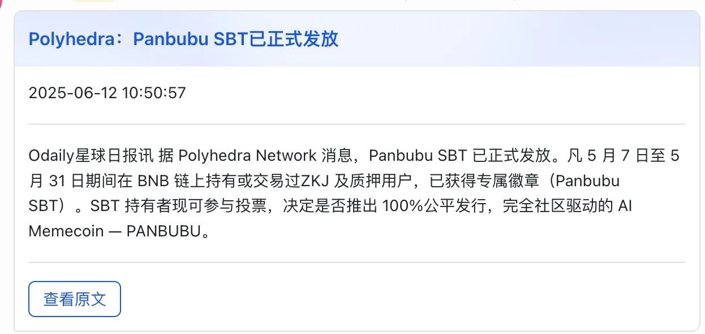

#### 1.3. 邀请空投

邀请空投是指：用户通过生成专属邀请码、邀请链接等方式拉新好友参与项目（如注册、交互、完成任务），从而获得空投资格或额外奖励。 

这是**Web3 最常用的“社交裂变 + 拉新”玩法**，既能提高传播效率，又能筛选活跃用户。   

设计要点

+ **强绑定**：邀请关系应通过链上地址/钱包绑定，确保数据真实
+ **奖励明确**：清晰告诉用户“邀请1人=多少奖励”，或“前100名有大空投”
+ **限制机制**：防刷机制不可或缺，可结合邮箱、钱包年龄、交互行为、设备指纹等验证
+ **传播工具配套**：建议搭配邀请卡片、海报生成器、自动跟踪榜单，提升社交传播效率

风险与注意

+ 容易被机器人“刷邀请”，建议配合行为验证或“邀请人被邀请人都完成任务”机制
+ 奖励要设计层级/上限，防止头部邀请者“吃独食”引发社区争议
+ 要提前设置**邀请作弊惩罚机制**（如地址黑名单、积分作废）	
+ 切记不要超过 3 代的邀请机制，有一定的风险

#### 1.4. 白嫖空投

白嫖空投”是指用户**无需任何交互、任务、邀请或贡献**，只要钱包满足某个条件，便可以直接领取空投。  
也被称为“纯快照空投”或“无条件领取空投”。

这个空投模式的核心是：**“你啥都不用做，我查链上记录就能给你空投。**

****

代表案例

+ **$UNI**（Uniswap）：直接向早期用户空投，无需任何操作，极具标志性
+ **$ENS**：给予曾注册域名的用户空投，创造高信任传播
+ **$LOVE、$TURBO、$MOTHER**：纯链上分发，任何人都能领取，引爆社交热度
+ **$PEOPLE（宪法 DAO）**：参与众筹失败后，大家自动白嫖到了一个 Meme 空投
+ **$NOT：**通过在 TG 上点一点获得积分，积分兑换空投

白嫖空投的“优点”

+ **传播力强**：门槛低，“羊毛党”+“真实用户”一拥而上，社交媒体容易引爆
+ **没有学习成本**：不需要任务教程或复杂操作，适合低门槛用户参与
+ **数据纯链上**：只依赖快照逻辑，发放过程自动可验证

白嫖空投的“风险”

+ **容易被滥领**：高比例被“机器人批量领走”或“撸空即走”，无留存价值
+ **无法筛选真实用户**：除非筛选逻辑设计很巧妙，否则发给谁都一样
+ **卖压极大**：由于用户无成本获取，极易在上线初期引发砸盘
+ **项目方难以回收价值**：如果没预先设计锁仓/任务/质押机制，白送基本换不到长期参与

白嫖空投最大的优势，是能在短时间内吸引大量用户，迅速点燃社交媒体热度。

它门槛极低、传播性强，是冷启动阶段拉流量、造声势的首选工具。

但真正有效的做法，是把白嫖空投当作“钩子”，与其他激励机制组合使用，比如邀请奖励、任务解锁、排行榜冲刺等，形成“组合拳”式增长打法，既吸引用户，也能转化和留存。

这种方式尤其适合没有背书、从 0 起步的小项目或新产品，用最小成本撬动用户增长的第一波势能。

#### 1.5. 社区空投

社区空投是指将 Token 奖励发放给**项目早期的社区参与者、治理者、贡献者或粉丝**，不以交易行为为基础，而更注重**贡献度、活跃度与忠诚度**。

它是对“共建者精神”的回应，也是 Web3 精神中“用户即合伙人”的典型体现。

适用场景

+ DAO 项目回馈活跃成员
+ 治理投票、内容创作、翻译、答疑等非链上行为的奖励
+ Discord/Twitter/Telegram 社群冷启动期的激励策略
+ 用于构建项目文化、强化社群认同感

 常见类型  

| 类型 | 描述 |
| --- | --- |
| **治理参与空投** | 参与 Snapshot 投票/链上治理的地址，获得奖励（如 Optimism） |
| **内容贡献空投** | 为项目写教程、翻译文档、发布优质内容者获得空投（如 Lens、Zora） |
| **活跃度空投** | 在 Discord/TG 发言数、活跃天数、答疑次数等作为评估标准 |
| **NFT 社群空投** | 持有特定社区 NFT 的成员获得空投，如社群徽章或 OG Pass |
| **积分排行榜空投** | 社群活动期间设积分榜，根据排名空投（适合预热和提高互动频率） |

设计要点

+ **明确评估机制**：如发言数、任务完成量、内容质量等标准，最好公开透明
+ **结合链上数据和链下互动**：推荐配合 Discord 活跃追踪、Twitter API、Galxe 任务等工具
+ **社区预期管理**：提前声明空投逻辑，让用户明白“不是靠运气，是靠参与”
+ **设置多个奖励档位**：避免“只有Top用户得奖”，保障更多人参与热情

#### 1.6. 质押空投

质押空投是指用户需要质押一定数量的 Token 或 NFT，作为参与空投的门槛或加权依据。

项目方通过这种机制筛选出愿意长期绑定的用户，防止“撸完就跑”，并增强 Token 经济模型的稳定性。

适用场景

+ 主网上线前后，激励用户提前锁仓，制造 FOMO
+ 防止白嫖行为，筛选真实认同者
+ 带动 Token 或 NFT 的质押需求，为代币赋能
+ Meme 项目转向更强社区绑定时的二次激励方式

质押空投的缺点很明显，若产品没有强大的融资背景和创始人背景，是没有人愿意参与的

### 2. 平台收益分成激励：绑定用户长期价值

#### 2.1. 邀请返佣激励

邀请返佣机制是指用户通过分享专属邀请链接/邀请码，邀请他人使用平台后，平台将被邀请人产生的收益（如手续费、订阅费用等）**按照一定比例返还给邀请人**，形成“你拉人、我分你钱”的增长激励闭环。  

常见适用场景

+ DEX / CEX 平台：邀请交易返佣（如 GMX、Bybit、Binance）
+ 钱包/插件类产品：用户邀请他人下载/使用，获得订阅分成或奖金
+ 工具类平台：比如 Telegram bot、交易工具、看板、AI 工具等
+ 预售平台/铸造平台：邀请用户参与 mint / 预售 / 投资，获得抽成

典型玩法模型

| 模式 | 描述 |
| --- | --- |
| **一级返佣** | 邀请一个用户，该用户交易或付费，你获得一定比例收益（最常见） |
| **多级返佣（裂变）** | 你邀请的人再去邀请，二级行为你也拿小比例分成（需注意监管合规） |
| **动态比例返佣** | 持仓/质押/等级越高，邀请返佣比例越高（鼓励用户成为“推广大使”） |
| **代币+USDT混合返佣** | 有些平台返佣不是原 Token，而是稳定币/平台 Token 混合发放 |
| **排行榜 + 奖金机制** | 邀请量前 N 名用户可获得额外奖金或空投激励，提升参与度和竞争感 |

成功案例参考

+ **GMX**：用户邀请其他人交易，赚取 10% 手续费分成，且邀请关系可绑定 NFT
+ **Binance**：推荐用户交易，最高返佣 50%，并与 VIP 等级挂钩
+ **friend.tech**：邀请新用户注册并充值，返佣 5% Key 买卖手续费

邀请返佣 = 让用户带用户，让流量自己生长  
是“收益共享 + 裂变传播 + 用户绑定”的黄金模型，适合所有想快速冷启动的 Web3 产品  

**邀请返佣 ≠ 只有上线后才能用  
**

**邀请返佣 = 让用户带用户，让流量自己生长。**  
它是“**收益共享 + 裂变传播 + 用户绑定**”的黄金模型，适合所有想快速冷启动的 Web3 产品。

有项目在产品尚未上线、没有任何收入的情况下，设计了一套裂变机制：

> 发布 999 枚限量 NFT，承诺未来产品上线后，将协议收入的 10% 分配给持有者。  
用户无法直接购买 NFT，必须通过完成任务获得，如写推文、拉新、参与社群互动等。  
>

 这一机制激发了用户参与感，实现了“**产品未上线，流量先行**”的效果，也提前锁定了未来最有价值的种子用户。 

#### 2.2. 内容传播分成

 内容传播分成是指用户通过撰写、发布或转发内容，为项目带来**流量、注册、交易或其他行为转化**，平台会根据其带来的效果给予分成或奖励。

相比单纯的邀请返佣，它更强调“内容质量 + 传播效果”，适合吸引创作者、KOL、内容型社群参与。

比如下图， Gate 交易所的营销案例，只是让在 KOL 内容里插了一句广告词，没有邀请链接，可能是按阅读量或按月付费的方式合作的。

### 3. 机会激励：用“未来可能”的奖励驱动现在的参与

机会激励不是直接给奖励，而是给“能获得奖励的希望”。  
这种机制更容易激发用户 FOMO 心理，用最小成本撬动最大传播，是冷启动的核心武器之一。**  **

#### 3.1. 白名单/预售资格

****

**案例A**

某项目发行了一套总量仅为 1,222 枚的 NFT，售价仅 $10，**价格低、数量稀缺**，对用户具有极强吸引力。  
此时推出“白名单机制”，让白名单用户优先参与 Mint。  

**案例B**

某项目融资已超过 500 万美金，但代币预售仅开放了极小额度，限制每人最多只可购买少量。**价格低、额度稀缺**，对用户同样具有极强吸引力。  
此时叠加“白名单机制”，让白名单用户优先参与预售。  

为了获得白名单资格，用户会想尽办法。此时项目方可安排一系列任务，如**宣传项目、撰写内容、制作视频、邀请好友**等，借助这批核心用户完成冷启动阶段的传播与用户积累。

#### 3.2. 积分榜 / 成长榜

积分榜（或成长榜）是一种典型的**机会激励机制**，用户通过持续参与任务，在排行榜中占位，后续根据排名获得奖励，如积分、NFT 或代币空投。

例如 **Kaito** 就是一个经典案例。  
用户在 X 上发布与项目相关的内容，**阅读量越高，获得的积分越多**，最终项目会根据积分排行榜的名次，发放一部分空投奖励。

这种机制通过“排名 + 空投预期”，激励用户长期创作与传播内容，形成裂变式增长。

### 4. 广告投流激励

广告投流虽然在 Web3 相对少见，但在特定阶段（如预售、空投、冷启动收口、交易所上线前）仍然是有效的流量催化器，可以作为补充性的增长手段纳入你的激励体系中。

#### 4.1. 社交媒体广告

+ 传统社交媒体

如 X（Twitter）、Telegram、Discord 等平台提供的原生广告投放，可精准触达 Web3 用户，但整体成本较高、投放门槛较复杂。

+ 区块链媒体

例如区块律动、PANews、Foresight、TechFlow 等主流中文 Web3 媒体，**费用相对合理，口碑好，适合做项目首发或空投预热**。

可以在平台的官网联系商务 BD 即可，快讯、文章都支持投放，这里还是强调标题一定要吸引人。

#### 4.2. KOL / 博主投放

KOL 是 Web3 营销中绕不开的角色，常见投放对象包括：

+ 推特加密博主
+ YouTube / 抖音 / B站 等内容型评测博主
+ Telegram 群主 / 币圈频道主

然而，目前 Web3 KOL 市场**定价极不透明**，缺乏统一标准，水分较大，以下是几点实操建议：

##### 4.2.1. 不要一上来就砸钱

大部分所谓“KOL”其实是矩阵号或假流量号，价格虚高但实际转化极低。**项目最好在已有一定市场热度或社群基础后再接触 KOL**，更容易谈合作，也更能筛选出愿意长期绑定的优质资源。

##### 4.2.2. 优先使用「机会激励」模式合作

不建议一开始就用现金投放，而是**通过白名单、预售额度、NFT 激励、未来空投**等机会性资源吸引 KOL 自愿参与。  
这种方式**更适合早期项目**，可以筛选出真正看好项目、有真实社区的创作者，也能避免直接付费的性价比陷阱。

##### 4.2.3. 强 KOL不会接冷项目，弱 KOL投了也没用

在项目尚无热度、曝光有限的情况下，**头部 KOL 往往不会接单**，而中尾部 KOL 又大多流量虚假、效果不稳。此时不如优先通过社群、用户裂变、内容传播建立第一批声量，再考虑精准投放。

##### 4.2.4. 找多个 KOL 文案一定不能相同

参考下图，用户都是聪明的。

当同一时间，不同 KOL 发布几乎一模一样的文案，

谁都能看出这是“收了钱统一发的广告”，而非真实推荐。

这类宣发不仅缺乏信任感，还可能引发用户反感，认为项目“花钱买热度、没有真实社区”，甚至在早期埋下“项目割韭菜”的负面印象。

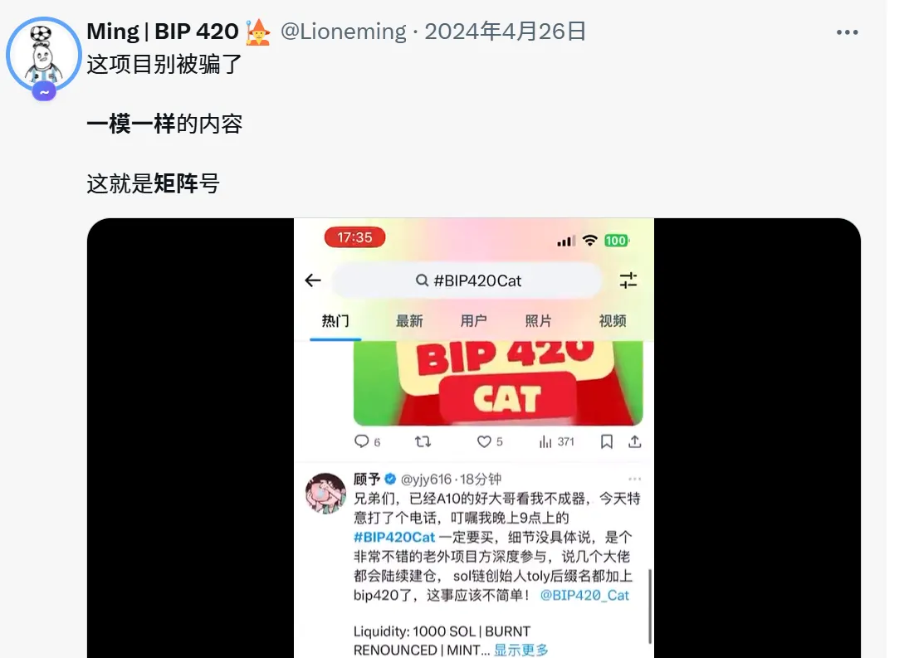

## 把学习力和思考力融入每一次运营

### 1. 学习驱动成长

营销不是一劳永逸的技巧，而是一项**需要持续学习与快速适应的能力**。市场在变、用户在变，唯有不断更新认知，才能始终跑在前面。  

想成为一个真正前沿的运营高手，必须保持学习与思考，持续关注最新项目，尤其是那些从 0 到 1 崛起的案例。  **去剖析，去拆解，去复盘他们的运营策略**，再结合自身产品灵活借鉴，能让我们少踩很多坑。  

就像作家余华曾坦言的那样：“我最初是模仿别人的风格开始写作的，后来才慢慢有了自己的声音。”  
他说自己早期写小说时非常喜欢卡夫卡，会模仿他的写法；“看很多人怎么写，我就怎么写，写得多了，就写我自己的了。”  

**这其实和运营学习是一样的：模仿是起点，思考是分水岭，内化后才是真本事。**

****

### 2. 思考驱动执行

假设你要与 100 位 KOL 合作，在推特上完成宣发并发起白名单抽奖。常规做法是：私信对接、等待回复、介绍项目、发送素材、确认发文、登记信息。流程繁琐、效率低下，几乎所有运营都在重复类似的机械动作。  

有没有更高效的方式？当然有。可以提前制作一个 Google 在线表单，把所有内容一次性整理清楚：项目简介、宣发奖励、文案模板、图片素材，并预留填写钱包地址与抽奖链接的区域。

同时加入邀请机制，KOL 填写邀请人地址，即可额外获得 10% 奖励。这样一来，合作流程标准化，执行自动化，传播也变成裂变式扩散。甚至可以将这套机制交给一个核心 KOL，由他去邀请更多人，自己形成传播网络，项目方只需发起规则并分发奖励。  

记住，Web3 运营的本质是**制定规则、设计激励机制**，而不是一味地投流，更不是沉溺于重复性劳作。营销应基于**深度思考与创意驱动**，同时保持持续学习，紧跟最前沿的增长方法。

