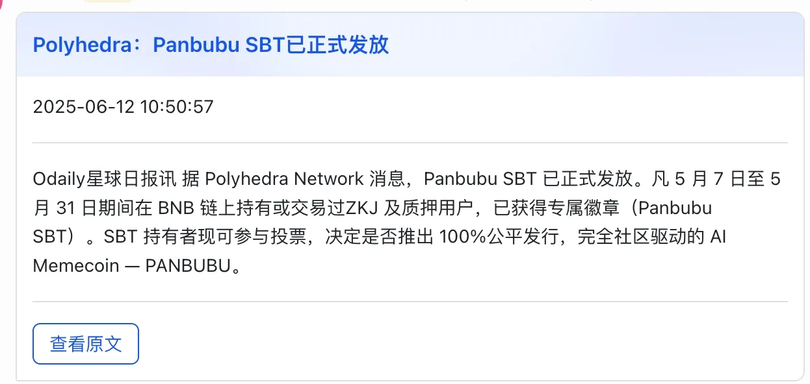
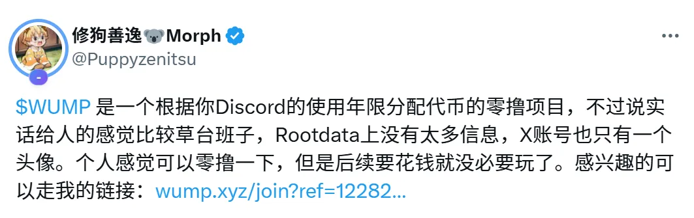

# 空投激励：撬动早期用户注意力和参与感

空投是 Web3 项目最常见的冷启动方式之一。
尤其是产品上线前，是最好铺开营销的一条路。

### 交互空投

交互空投是指项目方根据用户在早期阶段的链上行为（如转账、交易、桥接、质押、治理投票等），来判断用户的活跃程度，并据此分发 Token 奖励。    

适用项目
+ **大型基础设施类项目**：如公链、L2、跨链桥、去中心化协议等
+ **冷启动或测试阶段**：鼓励用户实际使用产品，为主网正式上线积累用户与数据

代表案例  
+ **Optimism（OP）**：根据用户在 L2 网络上的交互记录进行多轮空投，覆盖早期桥接、治理参与者等
+ **Arbitrum（ARB）**：对早期交互地址进行多维度打分（交易次数、周期、合约数量等）决定空投数量
+ **Starknet、zkSync 等 ZK 项目**：皆预期采用交互+行为评估来决定最终空投资格

设计维度
+ 交易次数（活跃度）
+ 活跃周期（非一次性交互）
+ 合约交互多样性（用过哪些协议）
+ 转账、交易金额（资金量）
+ 是否为真实用户（非批量机器人钱包）
+ 是否早期参与（时间窗口）

激励效果  
+ **对项目方**：精准筛选“真实用户”并形成产品早期数据积累
+ **对用户**：高价值回报，鼓励持续参与和链上行为
+ **对市场**：建立话题性，吸引用户主动使用其他新链、测试网

注意事项 
+ 容易被“羊毛党”批量注册和刷行为，因此大项目常配合反 Sybil 策略（如跨合约验证、持仓分布、Gitcoin Passport 等）  
+ 用户一般只对高融资，强背景的项目有交互的兴趣，不适合于新项目

### 吸血鬼空投

吸血鬼空投是一种直接“针对竞品用户”的空投策略：  
项目方通过识别其他协议的用户地址，并向其空投代币，**诱导其迁移到本项目**，达到“吸走对手用户”的目的。  

目标目的
+ 快速获取真实、活跃的行业用户
+ 打击/对标竞品，制造话题与流量
+ 构建社区初始种子用户池（精准且具参与习惯）

 典型案例  
+ **SushiSwap vs Uniswap**：  
Sushi 将 $SUSHI 空投给在 Uniswap 上提供 LP 的用户，成功吸引大量资金迁移
+ **1inch、dYdX、LooksRare、Blur**：  
均通过吸血鬼空投对 Uniswap、OpenSea、GMX 等头部协议用户进行定点攻击
+ **Blur 空投给 OpenSea 高交易用户**：  
实现了用户迁移 + NFT 市场格局重构

操作方式
+ 链上分析竞品用户地址（如 LP、交易者、NFT 持有者）
+ 空投代币或 NFT，附带激励要求（如完成任务、质押、迁移）
+ 引导用户迁移流动性或行为路径（如桥接、再交易）

战略价值
+ **高话题性**：容易引发社交媒体热议，“打擂台”式对抗具有传播力
+ **高用户质量**：目标用户已在竞品使用过，行为真实
+ **低冷启动成本**：无需从 0 获取用户，而是“抢熟客”

风险与挑战
+ 用户可能只是“撸完就走”，缺乏忠诚度
+ 容易激怒竞品，触发社区对立或“反击战”
+ 项目需有产品准备好“承接”这些被空投用户，否则留存困难

更多衍生
+ 也可以不攻击竞品，可以给同生态的项目进行空投，例如准备在 Solan 部署一个 Memecoin，可以给 Solana 手机、Solana 近期热门 Memecoin 进行空投

+ 什么火就可以吸血什么，例如近期 Biance Alpha 热度很高，有项目就针对 Biance alpha 交易量最多的 ZKJ/USDT 交易对的用户进行空投，给他们颁发了 SBT NFT，持有 NFT 可以进行投票，投票后可以获得代币空投

### 邀请空投

邀请空投是指：用户通过生成专属邀请码、邀请链接等方式拉新好友参与项目（如注册、交互、完成任务），从而获得空投资格或额外奖励。 

这是**Web3 最常用的“社交裂变 + 拉新”玩法**，既能提高传播效率，又能筛选活跃用户。   

设计要点
+ **强绑定**：邀请关系应通过链上地址/钱包绑定，确保数据真实
+ **奖励明确**：清晰告诉用户“邀请1人=多少奖励”，或“前100名有大空投”
+ **限制机制**：防刷机制不可或缺，可结合邮箱、钱包年龄、交互行为、设备指纹等验证
+ **传播工具配套**：建议搭配邀请卡片、海报生成器、自动跟踪榜单，提升社交传播效率

风险与注意
+ 容易被机器人“刷邀请”，建议配合行为验证或“邀请人被邀请人都完成任务”机制
+ 奖励要设计层级/上限，防止头部邀请者“吃独食”引发社区争议
+ 要提前设置**邀请作弊惩罚机制**（如地址黑名单、积分作废）	
+ 切记不要超过 3 代的邀请机制，有一定的风险

### 白嫖空投

白嫖空投”是指用户**无需任何交互、任务、邀请或贡献**，只要钱包满足某个条件，便可以直接领取空投。  
也被称为“纯快照空投”或“无条件领取空投”。

这个空投模式的核心是：**“你啥都不用做，我查链上记录就能给你空投。**

****

代表案例
+ **$UNI**（Uniswap）：直接向早期用户空投，无需任何操作，极具标志性
+ **$ENS**：给予曾注册域名的用户空投，创造高信任传播
+ **$LOVE、$TURBO、$MOTHER**：纯链上分发，任何人都能领取，引爆社交热度
+ **$PEOPLE（宪法 DAO）**：参与众筹失败后，大家自动白嫖到了一个 Meme 空投
+ **$NOT：**通过在 TG 上点一点获得积分，积分兑换空投
>案例参考
>>

白嫖空投的“优点”
+ **传播力强**：门槛低，“羊毛党”+“真实用户”一拥而上，社交媒体容易引爆
+ **没有学习成本**：不需要任务教程或复杂操作，适合低门槛用户参与
+ **数据纯链上**：只依赖快照逻辑，发放过程自动可验证

白嫖空投的“风险”
+ **容易被滥领**：高比例被“机器人批量领走”或“撸空即走”，无留存价值
+ **无法筛选真实用户**：除非筛选逻辑设计很巧妙，否则发给谁都一样
+ **卖压极大**：由于用户无成本获取，极易在上线初期引发砸盘
+ **项目方难以回收价值**：如果没预先设计锁仓/任务/质押机制，白送基本换不到长期参与

白嫖空投最大的优势，是能在短时间内吸引大量用户，迅速点燃社交媒体热度。
它门槛极低、传播性强，是冷启动阶段拉流量、造声势的首选工具。

但真正有效的做法，是把白嫖空投当作“钩子”，与其他激励机制组合使用，比如邀请奖励、任务解锁、排行榜冲刺等，形成“组合拳”式增长打法，既吸引用户，也能转化和留存。

这种方式尤其适合没有背书、从 0 起步的小项目或新产品，用最小成本撬动用户增长的第一波势能。

### 社区空投

社区空投是指将 Token 奖励发放给**项目早期的社区参与者、治理者、贡献者或粉丝**，不以交易行为为基础，而更注重**贡献度、活跃度与忠诚度**。
它是对“共建者精神”的回应，也是 Web3 精神中“用户即合伙人”的典型体现。

适用场景
+ DAO 项目回馈活跃成员
+ 治理投票、内容创作、翻译、答疑等非链上行为的奖励
+ Discord/Twitter/Telegram 社群冷启动期的激励策略
+ 用于构建项目文化、强化社群认同感

 常见类型  
| 类型 | 描述 |
| --- | --- |
| **治理参与空投** | 参与 Snapshot 投票/链上治理的地址，获得奖励（如 Optimism） |
| **内容贡献空投** | 为项目写教程、翻译文档、发布优质内容者获得空投（如 Lens、Zora） |
| **活跃度空投** | 在 Discord/TG 发言数、活跃天数、答疑次数等作为评估标准 |
| **NFT 社群空投** | 持有特定社区 NFT 的成员获得空投，如社群徽章或 OG Pass |
| **积分排行榜空投** | 社群活动期间设积分榜，根据排名空投（适合预热和提高互动频率） |

设计要点

+ **明确评估机制**：如发言数、任务完成量、内容质量等标准，最好公开透明
+ **结合链上数据和链下互动**：推荐配合 Discord 活跃追踪、Twitter API、Galxe 任务等工具
+ **社区预期管理**：提前声明空投逻辑，让用户明白“不是靠运气，是靠参与”
+ **设置多个奖励档位**：避免“只有Top用户得奖”，保障更多人参与热情
