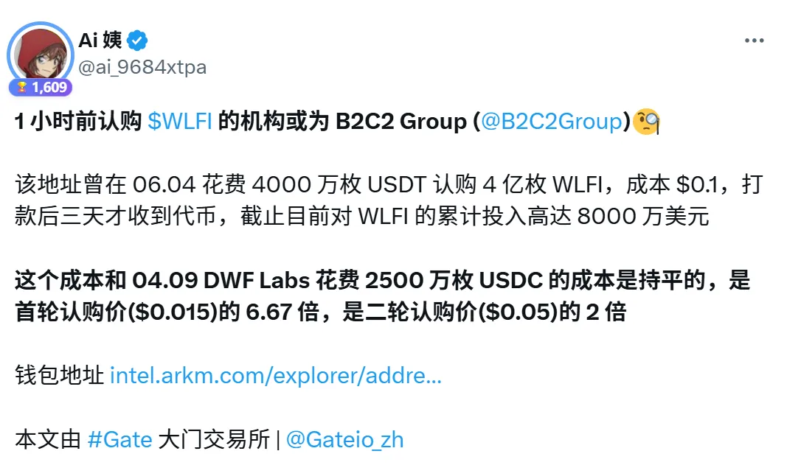

# 平台收益分成激励：绑定用户长期价值

### 邀请返佣激励

 邀请返佣机制是指用户通过分享专属邀请链接/邀请码，邀请他人使用平台后，平台将被邀请人产生的收益（如手续费、订阅费用等）**按照一定比例返还给邀请人**，形成“你拉人、我分你钱”的增长激励闭环。  

常见适用场景
+ DEX / CEX 平台：邀请交易返佣（如 GMX、Bybit、Binance）
+ 钱包/插件类产品：用户邀请他人下载/使用，获得订阅分成或奖金
+ 工具类平台：比如 Telegram bot、交易工具、看板、AI 工具等
+ 预售平台/铸造平台：邀请用户参与 mint / 预售 / 投资，获得抽成

典型玩法模型
| 模式 | 描述 |
| --- | --- |
| **一级返佣** | 邀请一个用户，该用户交易或付费，你获得一定比例收益（最常见） |
| **多级返佣（裂变）** | 你邀请的人再去邀请，二级行为你也拿小比例分成（需注意监管合规） |
| **动态比例返佣** | 持仓/质押/等级越高，邀请返佣比例越高（鼓励用户成为“推广大使”） |
| **代币+USDT混合返佣** | 有些平台返佣不是原 Token，而是稳定币/平台 Token 混合发放 |
| **排行榜 + 奖金机制** | 邀请量前 N 名用户可获得额外奖金或空投激励，提升参与度和竞争感 |

成功案例参考
+ **GMX**：用户邀请其他人交易，赚取 10% 手续费分成，且邀请关系可绑定 NFT
+ **Binance**：推荐用户交易，最高返佣 50%，并与 VIP 等级挂钩
+ **friend.tech**：邀请新用户注册并充值，返佣 5% Key 买卖手续费

邀请返佣 = 让用户带用户，让流量自己生长
是“收益共享 + 裂变传播 + 用户绑定”的黄金模型，适合所有想快速冷启动的 Web3 产品  

**邀请返佣 ≠ 只有上线后才能用**

**邀请返佣 = 让用户带用户，让流量自己生长。**  
它是“**收益共享 + 裂变传播 + 用户绑定**”的黄金模型，适合所有想快速冷启动的 Web3 产品。
有项目在产品尚未上线、没有任何收入的情况下，设计了一套裂变机制：

>发布 999 枚限量 NFT，承诺未来产品上线后，将协议收入的 10% 分配给持有者。
>用户无法直接购买 NFT，必须通过完成任务获得，如写推文、拉新、参与社群互动等。  

这一机制激发了用户参与感，实现了“**产品未上线，流量先行**”的效果，也提前锁定了未来最有价值的种子用户。

### 内容传播分成

内容传播分成是指用户通过撰写、发布或转发内容，为项目带来**流量、注册、交易或其他行为转化**，平台会根据其带来的效果给予分成或奖励。

相比单纯的邀请返佣，它更强调“内容质量 + 传播效果”，适合吸引创作者、KOL、内容型社群参与。

比如下图， Gate 交易所的营销案例，只是让在 KOL 内容里插了一句广告词，没有邀请链接，可能是按阅读量或按月付费的方式合作的。

