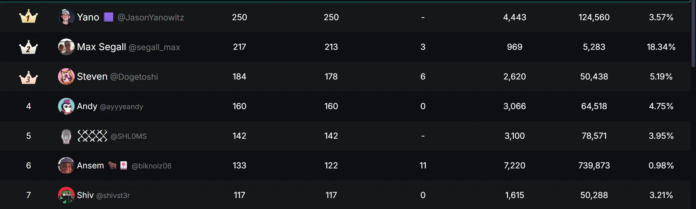

# 机会激励：用“未来可能”的奖励驱动现在的参与

机会激励不是直接给奖励，而是给“能获得奖励的希望”。
这种机制更容易激发用户 FOMO 心理，用最小成本撬动最大传播，是冷启动的核心武器之一。

### 白名单/预售资格

**案例A**
某项目发行了一套总量仅为 1,222 枚的 NFT，售价仅 $10，**价格低、数量稀缺**，对用户具有极强吸引力。  
此时推出“白名单机制”，让白名单用户优先参与 Mint。

**案例B**
某项目融资已超过 500 万美金，但代币预售仅开放了极小额度，限制每人最多只可购买少量。**价格低、额度稀缺**，对用户同样具有极强吸引力。 
此时叠加“白名单机制”，让白名单用户优先参与预售。

为了获得白名单资格，用户会想尽办法。此时项目方可安排一系列任务，如**宣传项目、撰写内容、制作视频、邀请好友**等，借助这批核心用户完成冷启动阶段的传播与用户积累。

### 积分榜 / 成长榜

积分榜（或成长榜）是一种典型的**机会激励机制**，用户通过持续参与任务，在排行榜中占位，后续根据排名获得奖励，如积分、NFT 或代币空投。

例如 **Kaito** 就是一个经典案例。
用户在 X 上发布与项目相关的内容，**阅读量越高，获得的积分越多**，最终项目会根据积分排行榜的名次，发放一部分空投奖励。

这种机制通过“排名 + 空投预期”，激励用户长期创作与传播内容，形成裂变式增长。
