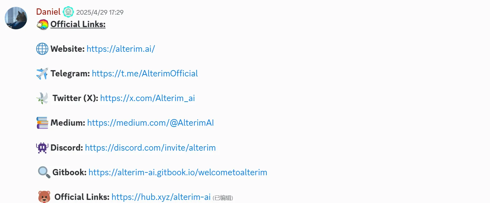

 # 如何做好一个 Web3 社群

 ### 社群引导的第一要务：让新人“秒懂你是谁、在做什么、什么不能做”

新人加入社群时，最重要的一步就是**快速建立认知**。
他们不应该靠猜，而是通过清晰的「置顶帖」和频道命名以及介绍，几秒内搞懂三个核心信息：
1. 你们是谁
2. 在做什么
3. 为什么值得关注
>参考 dappOS
>>

**固定展示以下关键链接**：

+ 官网链接
+ 社交媒体链接
+ 白皮书
+ 简洁的介绍性图文 / 视频
+ 加入任务、参与活动的入口

 这些可以通过机器人设置自动欢迎和推送，也可以整理为【新手导航帖】或【入门指南频道】。 

但最关键的是：

**社群管理者、项目方、核心用户要有统一共识，反复强化“我们是谁、为什么存在”的叙事。**
光靠 bot 不够，人带人的氛围感，才是 Web3 社群真正能留人的秘密。

社区一旦认可某一种文化就很难改变，因此必须从一开始就为可接受的行为设定明确的界限。

明确哪些行为可能会导致禁言，并快速一致地处理违规行为。
>参考 Hyperliquid Discord
>>

### 制定奖励机制：用好激励手段提升活跃度

激励机制不是发糖果，而是建立价值共识的一种方式。
让成员知道：他们的每一次发言、创作、反馈，都是项目成功的一部分，并且值得被看见、被奖励。
以下是一些比较社区奖励机制：

#### 身份激励

通过日常聊天活跃度、活动参与频率，发放不同等级的身份徽章、标签或称号，强化归属感与荣誉感。
如“核心成员”“超级贡献者”“早期见证人”等。

#### 任务激励

设置可执行的任务目标，如邀请好友、撰写内容、参与测试，完成即有奖励（积分/NFT/白名单等），既能调动积极性，也能扩散影响力。

#### 排行榜激励

建立公开可视的活跃度排行榜，让竞争带来动力。例如每周前十名获得特殊奖励，形成正循环。

#### 创作激励

鼓励用户产出图文/视频内容，通过点赞数、阅读量等指标发放激励，既促进内容传播，又增强社区话语权。

### 打造“社区拥护者的武器库”，让传播更顺手

想让社区成员自发传播项目，不能只靠一句“兄弟帮忙转发”，必须给他们一套顺手、好用、风格统一的传播工具。这就是我们常说的“社区传播武器库”。

一个好的武器库应该具备两个特点：

+ **丰富**：什么形式的内容都有，图文、视频、短语录、表情包等，方便不同人群快速使用。
+ **匹配**：风格调性要与项目形象一致，比如 meme 项目就不能做得太正经，技术项目就要尽量专业可信。

+ **Meme 表情包**：最好围绕项目 IP 或近期热点场景来制作，幽默、有梗、易于二次传播。
+ **活动海报模板**：例如邀请制活动、Space 预告、任务打卡等，可以做成系列风格，便于统一视觉、批量生产。
+ **内容类资产**：定期发布的深度内容，如创始人观点、行业洞察、AMA 精华、有奖征文等，提升项目权威性与可讨论性。
+ **阶段进展通报**：项目每达成一个关键进展，如数据增长、合作上线、版本更新，都制作成告示型图文，便于快速转发。

+ **结合项目特色的小内容**：
+ GameFi：短视频试玩片段、用户游戏记录图
+ 教育类：学习任务证书生成图
+ 技术类：每日一个技术知识点图解

