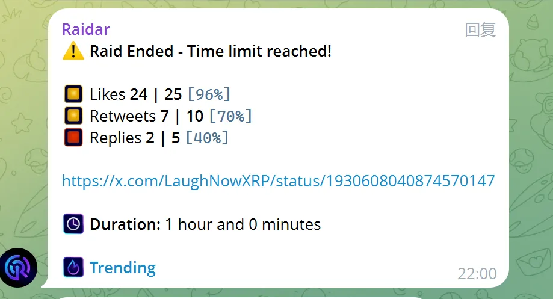

# 选对工具平台：不同平台适配不同策略

### Telegram

适合全球用户，门槛低、上手快，是 Web3 最主流的社群平台之一。适合用来承接空投用户、跑任务用户、早期社区建设。配合机器人可以自动化管理群规、任务、奖励等。

Telegram 必须掌握以下机器人 BOT 的使用技巧

#### [ROSE](https://telegram.org/)

全能机器人
支持进群欢迎、防广告、设定违禁词、关键词回复
[网页版本学习教程](https://www.tjsky.net/tutorial/594)、[视频教程](https://www.youtube.com/watch?v=IjPn-aNsNC0)

#### [Safeguard](https://t.me/safeguard)

电报社群门户，安全验证机器人

#### [Raidar](https://t.me/raidar)

电报社区冲推机器人，支持社区成员绑定自己的 X，管理员可发布突袭任务（给指定推文转发+点赞），全程在电报完成

### Discord

适合构建结构更复杂的社区（如 NFT、GameFi、DAO）。功能强大，适合多人协作、设立多个频道、分层权限管理。缺点是学习成本高、中文用户适应度不如 TG。

Discord 的机器人系统比 TG 更强大，可以参考以下教程学习：
[工具帖 | 5个Web3社区必备的Discord机器人](https://www.panewslab.com/zh/articles/iqxwj1v0)
[Discord Bot 教程系列](https://www.youtube.com/watch?v=5G4Q_GLKAn0&list=PL6nG8Y7KQjA-COaThDSds2r6ncgXo-Zn7)

### 微信群

适合维护小而紧密的用户圈层，适合做私域运营、种子用户维护、KOL关系维护。不适合大规模冷启动。

微信群无法配置 BOT，非常容易被风控，这点要特别注意。
例如 Web3 加密货币等关键词最好不要出现，若你的用户大部分来着国内，必须使用微信运营

建议用一个微信号把所有用户加一遍，然后该微信号不发任何关于 Web3 的内容，也不能做社群的群主，只做拉人和留存的角色。这样就算群被封了也不用担心用户流失。

### 推特社群

X（推特）是 Web3 项目最重要的内容分发和舆论发酵平台。适合输出观点、抢占 narrative、发布空投、做话题传播。推特社群可做长期运营补充，但用户粘性不如 Telegram 和 Discord。
