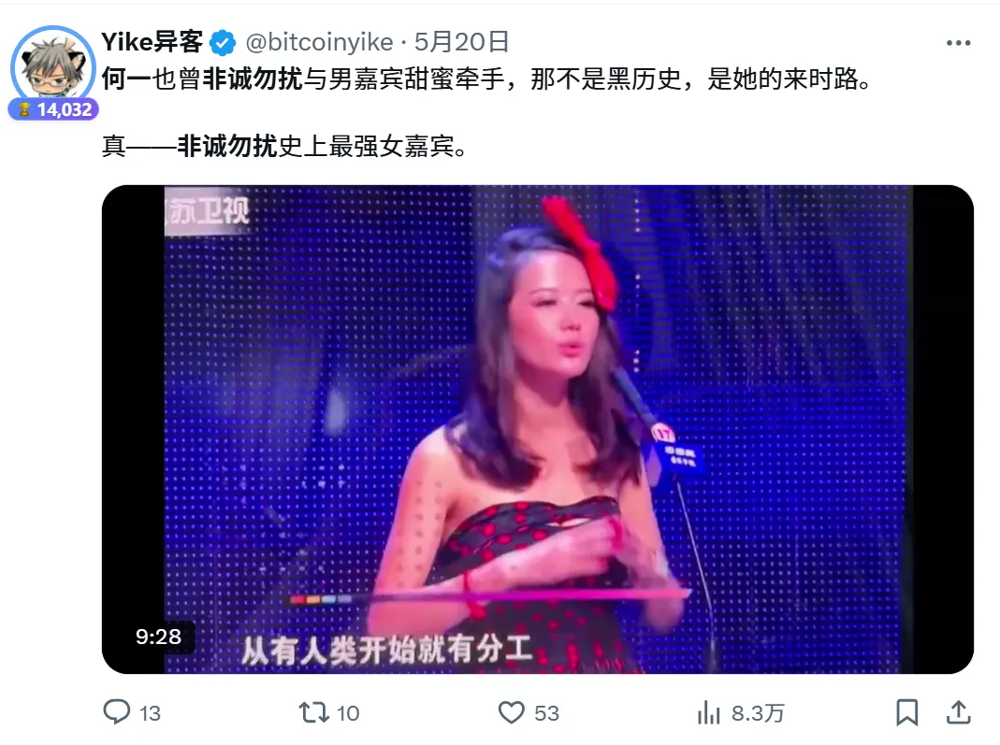

 # 什么样的内容最受欢迎

 ### 为用户创造价值的内容

 这是 Web3 用户最直接感知到价值的一类内容。
它的最大特点是：马上能动手或者学习，马上有结果。

比如：
+ 最新的链上空投教学（如 Binance Alpha、Monad 等热门交互机会）
+ 手把手教你挖掘低市值、有潜力的 Meme 币
+ 推荐一个年化收益超高的稳定币质押平台
+ 从 0 到 1 教你如何运营一个 Web3 项目
+ 专为小白设计的入门教程，帮你快速看懂链、钱包、DEX、NFT 等核心概念

这类内容的核心，就是“能落地、能赚钱、能看懂”。
谁讲得清楚、谁给的机会真实，谁就能吸引用户关注、信任和长期追随。

### 时效性强的内容

这类内容的核心就是一个字，快。
全世界的人都爱吃瓜，尤其是突发新闻和圈内大事。

当马斯克开喷特朗普、爆出爱泼斯坦名单；
当特朗普说“洛杉矶被外国敌人入侵”；
第一时间谁发了、谁说得有趣，谁就赢得了注意力。

在 Web3 也一样，时效性内容永远是流量密码：
+ 某项目突然上线、宣布合作、冲上交易所或开放空投
+ 某项目被黑了，全网炸锅
+ 某个大 KOL、VC、巨鲸地址突然操作
+ 链上数据异常，比如 gas 飙升、成交量暴涨
+ 某个 meme 或 narrative 突然爆火（比如“政治币”“AI Agent”）
+ 各种“你还来得及参与”的机会提醒

谁能**第一个发现 + 说清楚 + 引导参与**，谁就能拿到更多流量。  
这不仅能带动点赞、转发、评论，还能帮你树立圈内“消息源”的形象。  
要记住：**热点永远不等人，出手就得快、狠、准。**

---

>如图所示，该播主只是将特朗普在 Truth Social 的内容搬运到 X 并加以翻译，就获得了超过 1.1 万的阅读量
>> 

### 有趣/吃瓜类的内容

在信息爆炸的 Web3 世界，有趣就是竞争力。
再专业的内容，如果让人打哈欠，就没人愿意看。

而真正有趣的内容，能让人笑出来、惊一下、共鸣到，然后自然转发。
什么内容容易让人觉得有趣？下面给一些案例：

>+ **价值 109 美金的的排插骗局**
>>

>+ **近期一段“疑似 Binance 联合创始人何一早期参加《非诚勿扰》”的视频，在圈内刷了屏。虽然视频内容、配文几乎一模一样，但不同博主分别发出来，依然都获得了不错的流量。**
>>
>>
>>

### 持续性/系列内容

这类内容就像品牌的“定期广播”，不是靠一两次爆发，而是靠持续不断地输出，逐步在用户心中建立稳定的认知。

适合做成系列内容，每周、每月定期更新，让用户形成“记忆锚点”，只要想到某个领域，就会想到你。

以下是一些经典案例：
>+ [Layergg](https://x.com/layerggofficial)：长期坚持整理 Web3 每日、每月大事件，如今已经成为不少人月初、年初必看的信息来源。内容本身不复杂，但他靠着持续更新、格式清晰、节奏稳定，把账号做成了 Web3 信息导航入口，也让用户形成了“遇事看 Layergg”的习惯。
>> 

>+ [Ai 姨](https://x.com/ai_9684xtpa)，一直专注在 Web3 链上数据这个垂直领域，几年如一日地输出内容，目前已经成为该领域的头部  
24年 Ai 姨的广告摊位费是 300 美金，25 年的费用已经涨至 2000 美金
>> 

>+ 杀破狼：坚持输出高质量图表，不需要任何 Web3 基础，只需要整理数据并整合，办公室文员都能做。  
但他坚持做了找个系列，靠稳定输出和持续积累，如今也成为 Web3 领域的头部 KOL。
>> 

