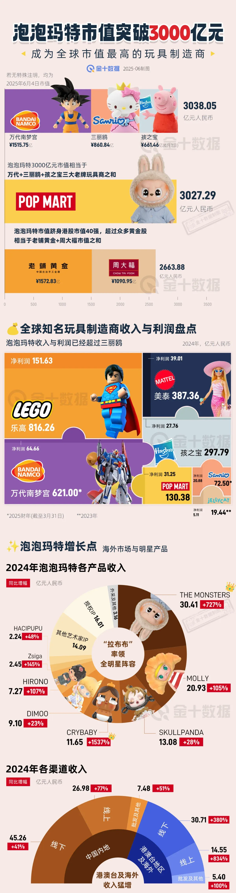

 # 怎么写好一份内容

 ### 确定营销的唯一目的

 写内容之前，先想清楚两件事：

👉 你希望读完后，读者做什么？
是关注你、点赞转发，还是点链接参与项目？

👉 你是写给谁看的？
是刚进圈的 Web3 小白，还是天天盯链上数据的老玩家？

想清楚之后，就要围绕这两点点，精准出击
内容创作别贪心，别一次塞太多任务给用户

一边想让人关注，一边又让人注册，还想转发抽奖，用户只会觉得累，直接划走。
一个内容，只聚焦一件事，才能让人真的行动。

### 90% 的时间用来思考标题

80% 的人只看标题，根本不会点开内容。你内容写得再好，没人看就是白搭。
所以标题必须狠！要做到一眼吸住 + 正中需求 + 引爆情绪。

很多同学有个误区：以为标题一定要和内容完全对应。其实不是。标题的首要任务是让人点进来，而不是准确概括内容。
别太纠结“准确”或“文采”，真正有效的标题，是够狠、够夸张、像广告一样抓人。稍微偏离主题没关系，只要能让人忍不住点开，就已经赢了一半。打开率才是王道。

下面给大家看一些案例

❌「何一早期参加非诚勿扰片段曝光」
✅「疑似曝光何一的早期恋爱史，全网疯传」

第一个标题标题信息太完整，用户看完就知道是“非诚勿扰 + 何一”，没有点击欲望。

第二个标题 保留悬念：“疑似”“恋爱史”“疯传”都在制造钩子，引发用户好奇：是她本人吗？真的谈过恋爱？到底传了啥？  

不要把“答案”直接写在标题里。好标题永远让人产生**“我想点进去看看”**的冲动，而不是“看完标题就知道了”。  

❌「TP钱包被盗案背后的真相：币圈安全启示录」
✅「又暴雷了！TP 钱包被盗！2亿资金被盗，涉及所有 Web3 用户！」

第一个标题太正经、太“概括型”了，像论文标题，没情绪、没钩子、没急迫感。
用户会觉得：“哦，是安全类科普，不急着看”

第二个标题通过“又暴雷了”：制造恐慌感 + 连续性，“2亿资金被盗”：强调损失规模，放大冲击力，“涉及所有 Web3 用户”：强相关性+制造“你可能也有危险”的代入感。

不要讲“真相”，要制造“危机”，标题里要有情绪、具体的数字、代入感

总之，在 Web3 内容营销中，标题比内容更重要。
哪怕你写得再专业、逻辑再清晰，如果没人点开，一切都是“写了个寂寞”。
想写出点击率高的标题，请牢记：

1、别讲事实，讲情绪： 
情绪 > 信息，恐慌、羡慕、愤怒、贪婪都能驱动点击。  

2、 别太准，得夸张：
稍微“离谱”一点的标题，才能抓住眼球，标题不是总结内容，而是引人点开。

3、 别全说完，要留钩子：
把故事讲一半，让读者脑子里冒出一句话：“我想知道后面发生了什么”。

4、 别装文艺，像广告一样狠：
用最直白、刺激、情绪拉满的词，比如「暴雷」「爆了」「疯传」「全网都在看」等。

**怎么学习写标题？**

****

最简单有效的办法就是：**学会“借鉴”！**
直接去看那些写得好的，爆款不断的账号，他们已经帮你踩过坑，总结出了最优解。
以下是推荐学习渠道：

**公众号推荐**
+ 【刘润】：商业逻辑、职场案例，标题写得极其抓人
+ 【金错刀】：典型的爆款风格，善于用冲突、情绪和数字打动人

 **头条 / 小红书 / B站**
+ 打开首页，看爆文标题是怎么写的，尤其注意高播放高收藏的视频标题
+ 模仿他们的结构、用词、情绪词，逐句练习

**建立个人标题库**

+ 每天手动收集 5 个让你忍不住点开的标题
+ 标注它用了什么公式（数字？反转？冲突？钩子？）
+ 久而久之，你会“下意识”写出好标题

记住：别把写标题当成写作文，它更像是在写广告文案！

### 尽可能说大白话

内容一定要“讲大白话”，能用一句话说清楚的，就别写成一段。  
复杂的术语和行业黑话，除非特别必要，尽量翻译成普通人能懂的说法。  
你不是来炫技的，是来让人看懂、愿意看、看完能转发的。

Web3 的信息很多，刷 X，看公众号都是碎片化时间，比如地铁、公交、上厕所、等电梯……都是快速一划，缺乏足够的耐心。

### 形成自传播

在 Web3 里形成「自传播」，不是锦上添花，而是 生死攸关。

Web3 初创团队不像 Web2 有广告预算，获客靠啥？
靠用户自来、用户帮你带用户，一传十，十传百。
这就是自传播的本质。

Web3 的热度窗口很短，一个热点最多红 3 天，
你不能等用户慢慢发现你，必须靠用户主动发、转、晒，才能抢在黄金窗口爆起来。

那么如何让用户自传播呢，下面梳理了几个技巧

#### 给用户“身份感”

Web3 里有很多种创造这些感受的方式，有的是技术手段、有的靠差异化运营。
把用户变成产品的一部分，例如加上「OG」「创世成员」等标签
给上一定的代币激励或者未来承诺

#### 给一定的激励

 没人会白帮你转，得让他有动力:
+ 有奖励（产品VIP、空投资格、NFT白名单）  
+ 有门槛（转发才能进社群）

#### 简单易传播

最被转发的不是长文章，而是**一张图 + 一句话**
信息密度高、视觉冲击强，特别适合 Web3 用户的碎片化阅读
加个标题党级文案，就是天然的种子传播单元

#### 追热点

有突发新闻（黑客、政策、暴雷、上线、KOL 吃瓜），第一时间输出观点 + 配图，天然自带流量
反应速度决定你能不能卡在第一波传播周期内，如果有现成模板或素材库，更容易秒出图、卷速度

[金十数据](https://weibo.com/igoldman?is_all=1)在这方面很值得学习和参考
