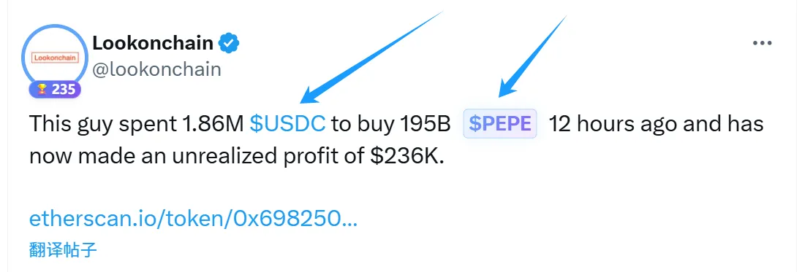

 # 内容营销的渠道/工具选择

 ### 核心内容发布渠道

 以下是常见的内容发布平台，适合输出深度观点、建立品牌影响力：
 | **渠道** | **类别** | **适合内容** |
| --- | --- | --- |
| [X](https://x.com/)（推特）、[farcaster](https://farcaster.xyz/)、小红书 | 公域流量拓展 | 项目动态、公告、热点段子、互动海报 |
| Telegram、Discord | 私域流量留存 | 实时公告、项目更新、用户互动、任务引导 |
| Mirror、Medium、微信公众号 | 公域流量拓展 | 深度文章、教程分析、项目科普 |
| YouTube / Bilibili | 公域流量拓展 | 视频讲解、AMA直播、纪录片、项目故事 |

### 常用到的工具

| **工具** | **用途** |
| --- | --- |
| [Canva](https://www.canva.cn/) | 设计传播视觉图、海报、推文配图 |
| [ChatGPT](https://chatgpt.com/)、[ideogram](https://ideogram.ai/) | AI 生图 |
| [ChatGPT](https://chatgpt.com/) | AI 润色文案、文章 |
| [谷歌表单](https://docs.google.com/forms/u/0/create?hl=zh-cn) | 收集用户反馈、问卷、参与信息 |
| [artstation](https://www.artstation.com/)、[pixabay](https://pixabay.com/zh/)、[pinterest](pinterest)、 | 图片搜索 |
| [zuomeme](https://www.zuomeme.com/) | Meme 图制作 |

### 单独讲一下 X

X（Twitte）是 Web3 领域最高效的社交媒体平台之一。是运营人员需要熟练掌握的一个平台创始人/团队成员可以通过传递产品理念、团队的态度与专业性、以及未来的规划。
以下分享一下关于 X 的技巧

### 新 X 应该注意的事项

因为考虑到现在注册 X 不方便，大部分用户都是从第三方平台购买 X，
此外还要注意不要频繁的切换 IP，注册前三天不要发文，等缓个几天，按照以下流程执行：
1、修改邮箱
2、确定并修改推特资料( 名字、头像、简介、横幅  )
3、添加或修改 2fa 验证  
4、修改密码
5、开通蓝V

### 标签的重要性

加上合适的标签，推文才能进入对应的话题页面，有机会被更多非粉丝用户看到。
尤其是像 $BTC、#Airdrop 这种热门标签，自带巨大流量池，能帮你轻松获取圈外曝光。

但要注意，标签必须贴合内容主题，不要乱打热门、也不要一次打太多（不超过 4 个）。
标签太杂、或和内容无关，反而会被算法判定为低质量内容，影响推送权重。

**标签 $：**
这是 Web3 圈的默认格式，很多用户会直接搜索 $TOKEN 名来看项目动态或讨论。
例如：$BTC（而不是 BTC）$ETH
