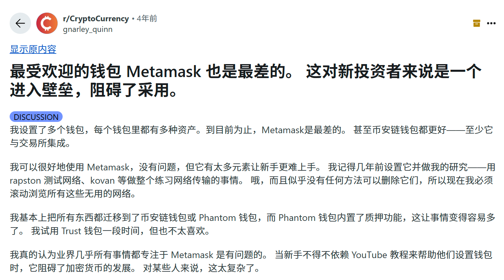
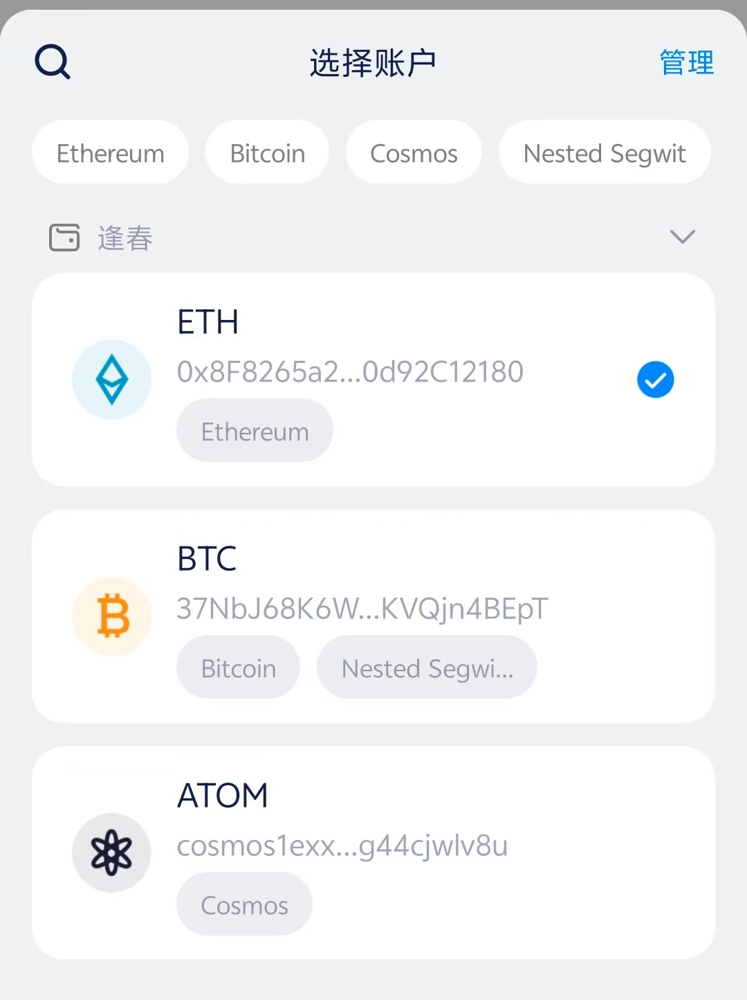

# 打造属于你的“Web3 第一”标签

什么是叙事中的“唯一性”？
它不是说你的项目“全宇宙独一份”，而是要占据用户心智的某一个“标签”。

### 浏览器插件钱包第一：Metamask

它不是最便宜、最好用的钱包，但它是第一个无需写代码、普通用户也能用的以太坊钱包，抢占了“链上入口”的用户认知。尽管竞争对手提供更低的交易费，等丝滑的功能，依然无法撼动 Metamask 作为首选加密钱包的地位。

### 中国区手机钱包第一：imToken

imToken 上线于 2016 年，是不少中国用户接触的第一个手机区块链钱包。

虽然这些年产品更新不快，默认只支持 ETH、Bitcoin 和 Cosmos 三个网络，连 Swap 功能都没有，但它的用户量依然很大，官网数据显示，累计用户已超 2000 万。  

团队迭代能力很一般，甚至到今天，默认只有 ETH、Bitcoin、Cosmos 3个网络，甚至内嵌的 SWAP 都没有。笔者在私域社群里里经常看到有人问：“imToken 下载地址在哪？”

这说明，即使没强运营、没新功能，它依然是很多用户心里“最熟悉的钱包”。

### 总结

**类似的故事还有很多，例如：**

+ Ordinals：第一个实现比特币链上铭文协议
+ Notcoin：第一个爆火的 Telegram 游戏 + 挖矿结合玩法
+ Uniswap：第一个使用 AMM 自动做市机制的去中心化交易所
+ ENS：第一个将以太坊地址映射为“.eth”人类可读域名的项目

无论是 Metamask 成为第一个普通用户能用的以太坊钱包，
还是 imToken 抢下“中文用户首选手机钱包”的心智，
它们胜出的关键，不是功能最强，而是：够早、够明确、让人记住。

**所以，做营销请记住：**
在 Web3 的传播逻辑中，“第一个”远比“最好”更重要。
运营要做的，不是讲一堆功能，而是提炼出产品最突出的、最创新的一点，并把它包装成一个‘唯一性’故事传播出去。
无论是机制创新、场景切入，还是目标人群不同，**你都必须找到一个角度，让项目看上去像是“第一个这么做的”。**
如果你找不出“第一个”，那问题可能不在运营，而在产品本身。没有独特卖点，运营就是在“卖一个平庸的功能集”。