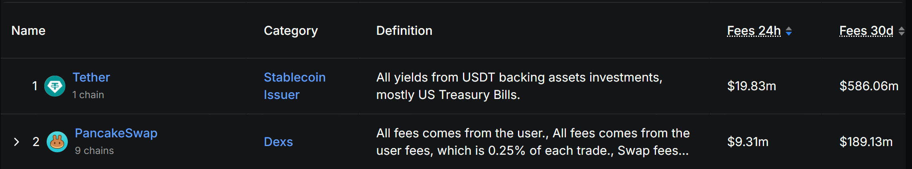
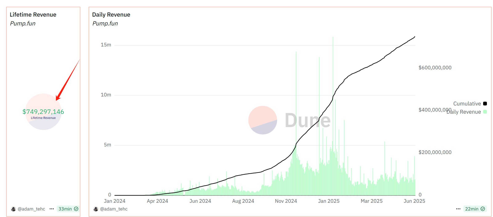
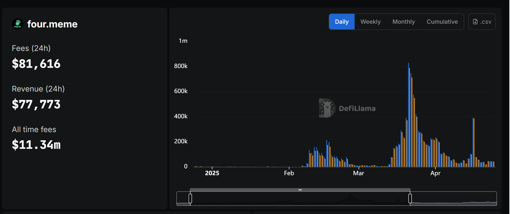

 # 另辟蹊径，也能做“第一”

大家会发现，目前大多数热门赛道早已被先行者占据。
这也是你必须跳出红海、创造差异化叙事的理由。
与其在主战场卷死，不如另辟蹊径，重新定义一个“小赛道”，抢占一个“另类的第一”。

### 案例解析：Uniswap V2 带来的机会

Uniswap V2 采用 MIT 开源协议，任何人都可以复制、修改并商用。
于是，一批项目抓住了这个机会，虽然没能成为以太坊上的第一个 SWAP，却在别的链上拿下了“第一个”。

+ QuickSwap 成为 Polygon 的第一 SWAP
+ PancakeSwap 成为 BNB Chain 的第一 SWAP
+ Trader Joe 成为 Avalanche 的第一 SWAP

这些项目通过 Fork + 本地化适配，分别成为各自链上的龙头。
尤其是 PancakeSwap，如今单日手续费达 931 万美元，月收入高达 1.89 亿美元，甚至一度超过了 Uniswap 的链上收入。

试想一下，
如果 PancakeSwap 当年也部署在 ETH，即使功能更强、激励更猛，也很难撼动 Uniswap 的地位。
正是“换一条链，做另一个第一”，让它完成了弯道超车。

### 案例解析：Pump.fun 带来的机会

Pump.fun 是近两年 Web3 最大的吸金黑马。
截至 2025 年 6 月 12 日，营收已突破 7.5 亿美金，日交易热度长期霸榜 Solana。

它的本质创新很简单：
+ 降低 meme 币发行门槛
+ 无需代码、3 秒发币、极致轻体验

随后专注于 BNBChain 的 BinaryX 团队就嗅到了商机
他们几乎原样复刻了 Pump.fun 的核心玩法，推出了 BNBChain 的 meme 发币平台，Four.meme。
虽然玩法几乎没有改动，但因抢占了 BNB 生态的空白市场，Four.meme 依然迅速起势。

截至 2025 年 6 月 12 日，平台营收已接近 1134 万美元。
虽然远不及 Pump.fun 的体量（7.5 亿美元），但对于处在下滑边缘的 BNX 项目来说，这无疑是一次“逆风翻盘”

### 案例解析：StepN

2021 年，区块链游戏迎来大爆发，
以 Axie Infinity 为代表的链游赛道出现了井喷式增长，资本和用户蜂拥而至。

就在这个火热时期，有个项目走出了一条完全不同的路——StepN。
它清楚自己无法在传统链游领域挑战 Axie 的地位，于是果断另辟蹊径，提出了一个全新的概念：运动赚钱

通过将“跑步”与链上资产绑定，StepN 成功开辟出一个全新的利基市场，
不仅避开了传统链游的正面竞争，还迅速成为“运动赚钱”赛道的代名词和龙头。

### 总结

就算你做不出全网最牛的创新，
只要你能找到一个别人还没做的地方去复制爆款，照样能打出成绩。

换条链，换个角度，或者换个用户群，
你就能把一个“别人的成功”，变成“你的第一个”。

别死磕正面刚，把老想法搬到新地方，
也能赢得漂亮。
