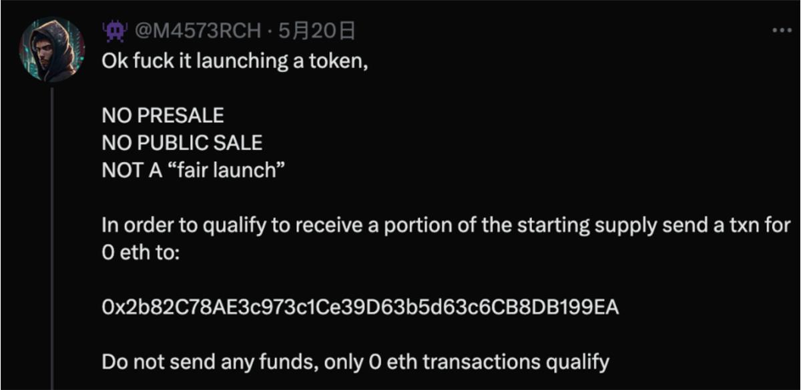

# 让项目出圈的关键：造话题和讲故事
 
### SLERF：灾难变营销，Web3 最大乌龙

2024 年 3 月 19 日，Memecoin SLERF 项目在 Solana 上预售，募集超过 5 万枚 SOL。
原计划是给预售用户发放 $SLERF 代币，但没想到，项目方 @Slerfsol 一条推文引爆全网

他“手一抖”，误操作销毁了 LP 和空投预留的全部代币，甚至连铸币权限也一并撤销。
整个社区顿时炸锅，他自己也在 X 上开启 Space 当场“哭了出来”，瞬间成为币圈名场面。

但最戏剧性的还在后面。这场彻底失控的事故，反而成了最强营销事件.
事件发酵不到 30 分钟，全网传播，SLERF 直接爆红，市值破亿，最高一度冲上 7 亿美金，登顶当时 meme 榜首，堪称一夜封神。

尽管现在热度已过，但 SLERF 用“事故 × 情绪 × 全网参与”证明了：
只要话题够疯，连灾难也能变成资产。

### XEN：刷屏全网的免费挖矿实验

2024 年 9 月，一款突然爆火的区块链项目 XEN，刷屏了整个 Web3 圈子。
这个项目制造的话题度极强，让它迅速成为社群热议焦点：

+ 创始人背景离奇：自称是 Google 第 21 号员工，Jack Levin
+ 免费挖矿机制：不卖币、不预售，只要付 gas，就能免费铸造 XEN
+ 链上燃烧级别事件：短时间内导致 ETH 网络严重拥堵，gas 飙升，一度占据以太坊 24 小时内 47% 的 gas 销毁量

这样的设定，让 XEN 在没有空投、没有资本背书的前提下，仅凭话题性就席卷 Web3 社群，
迅速引发链上“免费挖矿”风潮，成功打响品牌，完成一次极具话题驱动力的冷启动营销。

### LOVE：一笔 0 ETH 转账引爆 12 万地址的链上情绪

2024 年 5 月 30 日，加密 KOL @M4573RCH 发起了一场实验，推出了 Meme 代币 $LOVE。
没有预售、没有公售，只需向指定地址发送 0 ETH，即可参与空投。

就是这样一个极简的操作，迅速引爆了社群。

让我们把视角转向 LOVE 的市场传播表现：
+ 官方 X 账号在 5 月 27 日注册，仅用 4 天就吸引了超 18,000 名关注者
+ 上线当天，$LOVE 的 ETH 销毁量一度超过 Uniswap，成为以太坊全网销毁量第一名
+ 根据链上数据，空投期间共有 126,896 个地址符合领取条件

在 Web3，传播从来不靠精美PPT或复杂技术，
而是靠：“一个人人都能讲的故事 + 一个人人都能参与的动作 + 一种情绪共振的氛围”。

想做爆款，不如先问自己一句：
这个项目的故事，你讲得出口吗？别人愿意讲下去吗？